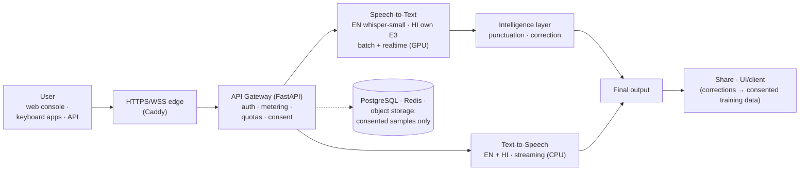

# IntelliAI — High-Level Architecture (Executive View)

*Management-friendly view; the deep internal reference is
`docs/ARCHITECTURE.md`. Status: reflects the repository as of
2026-09-01; served today on the production-shaped staging stack (no
public server deployed yet).*

## Diagram A — Executive architecture (compact)

## What each piece is

- **Edge (Caddy)** — TLS termination for web and WebSocket traffic.
- **API Gateway** — one FastAPI app: authentication before anything,
  append-only usage records (billing-safe), quotas, data-collection
  consent, and the public OpenAI-compatible API + web console.
- **Voice runtimes** — separate services per capability (STT, TTS),
  engines swappable behind a frozen internal contract; model weights are
  SHA-pinned and verified at startup (a wrong artifact refuses to serve).
- **GPU host services** — realtime engines and the Hindi GPU server run
  beside the containers on the GPU host; one 8 GB card fits the whole
  voice stack (measured 5.3 GB peak).
- **Storage** — PostgreSQL (truth), Redis (limits, losable), object
  storage (only consented samples; silence/cancel stores nothing).

## Standing laws (why this is a platform, not a demo)

1. Product names are permanent; **engines are replaceable** — models have
   been swapped with zero customer-visible API change.
2. Billing never depends on which model served a request.
3. Every capability ships behind a flag with a drilled rollback.
4. Readiness endpoints tell the truth (`ready/degraded/disabled`) and a
   broken GPU fails deployment, never a customer request.
5. Every quality/latency claim traces to a frozen benchmark and an
   append-only evidence ledger.
