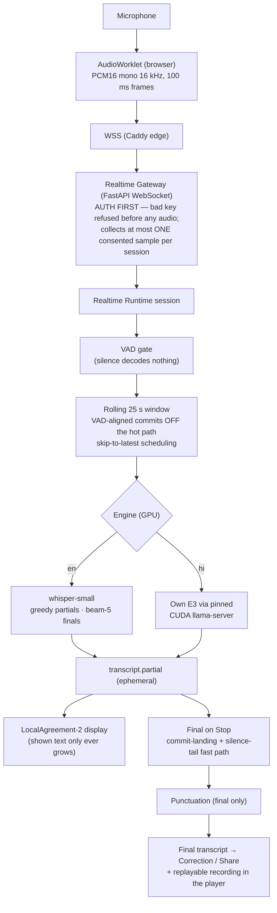

# IntelliAI — Realtime STT Architecture

*As implemented (M53) and hardened (M54–M55); staging-verified, flags
OFF in production config. Status: 2026-09-01.*

## Session flow



## Stop sequence (why finals are fast and never lost)

```mermaid
sequenceDiagram
    participant B as Browser
    participant G as Gateway
    participant R as Runtime
    B->>G: end (Stop pressed; mic already off)
    G->>R: end
    Note over R: land any in-flight commit,<br/>then decode only the remainder —<br/>or reuse the last decode if the tail is silence
    R->>G: transcript.final (punctuated + raw)
    G->>G: collect ONE consented sample
    G->>B: session.completed (+sample id)
    B->>G: close (ordered shutdown — no lost events)
```

## Hardening laws (each from a measured incident)

| Law | Origin |
|---|---|
| Auth before audio; 4401 before a single frame | design + drills |
| VAD gates every decode (silence = zero inference) | bare models hallucinate on silence (measured) |
| Display monotonic by construction | live-shrink bug caught in browser E2E |
| Repetition guard: detect → retry → trim to 2 + seam-collapse; legitimate "हाँ हाँ" untouchable | a real decoder loop event |
| Bounded everything: 64 KB frames, 60 s lag → loud `degraded`, 900 s cap | flood drills |
| Readiness `ready/degraded/disabled`; dead GPU backend cannot fake ready | failure drills (live) |
| One-switch rollback; batch survives every failure mode | drilled repeatedly |

## Measured envelope (RTX 5070, staging, M54–M55)

EN: first text p50 1.10 s, updates 0.53 s, final 0.20 s ·
HI: first text 0.33–0.42 s, updates 0.62–0.79 s, final ≤1.43 s ·
Safe capacity 2 sessions/GPU (4 = degraded burst) · whole stack 5.3 GB
VRAM on one 8 GB card.
