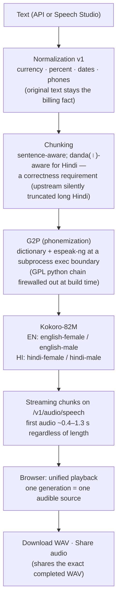

# IntelliAI — TTS Architecture

*English + Hindi, production-approved (repository state; deployment
pending). Status: 2026-09-01.*

## Why these choices (measured, not preferred)

- **Kokoro selected** on benchmarks: EN trap-set round-trip WER
  0.1247 → **0.0659** after our hardening (beat every challenger
  measured, incl. Supertonic and Magpie); Hindi clean RT-WER
  **0.045–0.062** across the four upstream voices. Permissive license
  with the GPL text-chain excluded — verified at build time.
- **Qwen3-TTS not serving**: base+clone can beat Kokoro on clean text,
  but its fine-tuning collapsed (loss curves recorded) and
  latency/serving economics lost. Its TRUE frame-level streaming
  (TTFA 0.80 s) remains a researched option.
- **Streaming (M36)**: whole-body synthesis made first-audio scale with
  text length (27+ s worst case); progressive delivery makes it
  length-independent with zero quality regression.
- Quality is judged by **round-trip through our own STT** — the same
  frozen probe sets every time, so improvements are provable.
