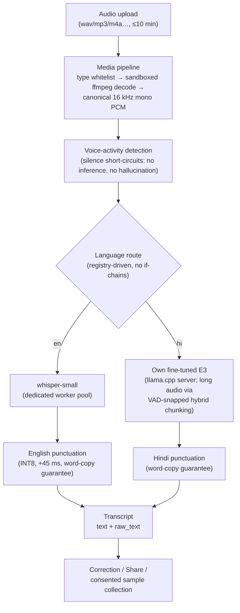
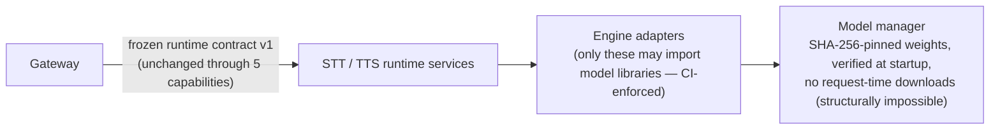

# IntelliAI — Voice Processing Architecture (Diagram B)

*Detailed view of the voice path; status as of 2026-09-01.*

## Batch STT path (upload/record)

- Hindi batch on GPU (validated M55, production-required decision): the
  same E3 model served by a pinned GPU llama-server — this **eliminates**
  a measured CPU-only instability on long multi-speaker audio
  (2–94 words scatter → 117 words byte-identical ×5).

## Engine isolation (why models are swappable)

## Quality machinery around the models

- Frozen evaluation sets (speaker-disjoint Hindi primary; English trap
  sets; punctuation slot rulers) — models compete on fixed ground.
- Append-only MODEL_LEDGER records every measurement, including failures.
- Promotion = a reviewed repository decision with a drilled rollback,
  never a silent swap.
