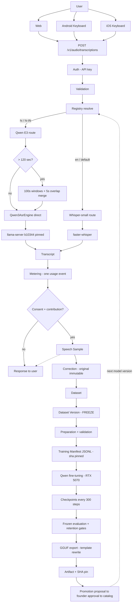

# IntelliAI STT Fine-Tuning Pipeline — Complete Hinglish Guide

> Ye document humari ACTUAL repository ke code par based hai — har file,
> function, aur number committed code/records se verify kiya gaya hai.
> Padhne ka time: 1–2 ghante. Style: simple Hinglish, zero assumed ML
> knowledge.

---

## THE BIG PICTURE — poora safar ek nazar mein

```
User Speech                        ← user bolta hai (Web/Android/iOS)
     ↓
Speech Sample                      ← (consent ho to) audio + transcript store
     ↓
Correction                         ← user galti sudhaarta hai
     ↓
Dataset                            ← samples ka collection (rules ke saath)
     ↓
Dataset Version                    ← FREEZE: membership lock ho gayi
     ↓
Training Preparation               ← validation + manifest banana
     ↓
Training Manifest (JSONL)          ← training ki final shopping list
     ↓
Qwen3-ASR Fine-tuning              ← GPU par model seekhta hai
     ↓
Checkpoints                        ← har 300 steps par model ki photo
     ↓
Evaluation                         ← frozen benchmark par report card
     ↓
Export                             ← HF checkpoint → serving format
     ↓
GGUF                               ← llama.cpp ka model format
     ↓
Qwen Runtime                       ← pinned llama-server serve karta hai
     ↓
IntelliAI API                      ← POST /v1/audio/transcriptions
     ↓
Web / Android / iOS                ← transcript user tak wapas
```

Kaun sa hissa kya hai:

| Stage | Category |
|---|---|
| User speech → Speech Sample → Correction | **DATA COLLECTION** |
| Consent, license, speaker rules, freeze | **DATA GOVERNANCE** |
| Dataset Version → Manifest | **DATA PREPARATION** |
| Fine-tuning → Checkpoints | **TRAINING** |
| Frozen benchmark, CER/WER, probes | **EVALUATION** |
| Export → GGUF → SHA pin | **MODEL PACKAGING** |
| Runtime → API → clients | **SERVING** |
| Proposal → approval → catalog | **PRODUCTION PROMOTION** |

---

## SECTION 1 — Hum problem kya solve kar rahe hain?

**Kahani shuru se:**

1. **Whisper pehle kyun tha?** OpenAI ka Whisper ek ready-made, MIT-license,
   ~100 bhashaon wala STT model hai. Day-1 par sabse safe choice — install
   karo, chal jaata hai. Humne `whisper-small` (Systran faster-whisper
   conversion) se shuruaat ki. English par ye bahut accha tha (WER 0.0
   humari eval par), lekin **Hindi par kamzor: CER 0.3629** (matlab har 100
   characters mein ~36 galat).

2. **Qwen kyun test kiya?** Hindi improve karni thi. Pehle humne Whisper ko
   hi fine-tune karne ki koshish ki (E1/E1b — Section 10-11, dono fail).
   Phir Alibaba ka **Qwen3-ASR 0.6B** test kiya — ek chhota audio-LLM.
   Bina kisi training ke, out-of-the-box: **Hindi CER 0.1457** — Whisper se
   **60% behtar**. Isliye Qwen Hindi-specialist ban gaya (research mein).

3. **Fine-tuning kyun ki?** 0.1457 accha tha par aur behtar ho sakta tha.
   Fine-tuning = pehle se trained model ko APNI Hindi data par thoda aur
   sikhana.

**Simple analogy:** Socho ek doctor (pretrained model) jo MBBS kar chuka
hai — general medicine jaanta hai. Fine-tuning matlab usko 6 mahine ki
**cardiology specialization** karwana — wo doctor hi rehta hai, bas dil
ke cases mein expert ho jaata hai. Hum Qwen ko "Hindi specialization"
karwa rahe the.

**Paanch words jo confuse karte hain:**

| Term | Simple meaning |
|---|---|
| **Pretrained model** | Factory se aaya hua model (Qwen/Qwen3-ASR-0.6B, jaise Alibaba ne banaya) |
| **Fine-tuned model** | Humari data par aage sikhaya hua version (qwen-e3-hi-sft) |
| **Checkpoint** | Training ke beech model ki "photo" — us moment ke weights (checkpoint-1500) |
| **Exported model** | Serving format mein convert kiya hua (GGUF file) — training nahi kar sakta, sirf inference |
| **Production model** | Wo exported model jise catalog ne officially route kiya hai (`qwen3-asr-0.6b-hi-ft-e3@v1`) |

---

## SECTION 2 — Data kahan se aata hai?

### 2a. User data (future ka raasta)

```
User bolta hai → transcription → Speech Sample (consent ho to)
→ correction → dataset membership → dataset version
```

Ye poora backend flow Section 3-4 mein detail se hai. **Important sach:**
ab tak ke saare fine-tunes (E1/E2/E3) **PUBLIC data** par hue hain —
customer audio kabhi training mein nahi gaya. User-data pipeline bana hua
hai, ready hai, par abhi tak use training mein use nahi kiya.

### 2b. Public training data (jo actually use hua)

Har source ek **registry** mein pehle register hota hai — license, access,
verification date ke saath:

**File:** `ml/datasets/src/intelliai_datasets/sources.py`
**Class:** `SourceRecord` · **Data:** `SOURCES` tuple · **Function:** `usable_now()`

**Simple meaning:** "Koi bhi byte use hone se PEHLE uska license record
banta hai. Jo source use nahi ho sakta wo bhi register hota hai — BLOCKED
ek status hai, chhupana nahi."

| Source | Kya hai | License | Kyun use kiya |
|---|---|---|---|
| **IndicVoices** (ai4bharat) | Spontaneous Hindi speech, speaker-ids ke saath | CC-BY-4.0 | Sabse bada Hindi backbone — real bolchal |
| **Kathbath** (ai4bharat) | Clean read Hindi speech | CC0 | Saaf-suthri padhi hui speech |
| **FLEURS** (google) | Multi-language read speech | CC-BY-4.0 | E3 ka **English retention slice** (en_us config) |
| **Short-Hindi slice** | IndicVoices ke hi 0.5–2 sec real clips | CC-BY-4.0 | E2 mein 1-sec speech fail hui thi — ye slice usse theek karta hai |
| **No-speech negatives** | Generated silence/noise + real room-tone | Synthetic + CC-BY-4.0 derivative | Model ko sikhana ki "silence = kuch mat likho" |

**Ingestion (data download + disk par rakhna):**

**File:** `ml/datasets/src/intelliai_datasets/ingest_fleurs.py`
**Function:** `ingest_fleurs(config, split, data_root, ...)`
**Simple meaning:** "FLEURS ke parquet shards download karo (retry +
resume ke saath — `_download_shard`), har row ka audio original bytes
mein disk par likho, aur ek candidates JSON banao."

**File:** `ml/datasets/src/intelliai_datasets/ingest_hf.py`
**Function:** `ingest_hf(spec, ...)` — gated HuggingFace sources
(IndicVoices/Kathbath) ke liye, token ke saath.

**Revision pinning:** har ingest apne saath `source_revision` record
karta hai (HF dataset ka exact commit) — taaki 2 saal baad bhi pata ho
data KIS version se aaya tha.

**Negatives:**

**File:** `ml/datasets/src/intelliai_datasets/negatives.py`
**Function:** `generate_negatives(...)`
**Simple meaning:** "Seeded (deterministic) silence, halki noise, aur
already-ingested clips ki sabse shaant 4-second windows banao — ye
'no-speech' training examples hain."

---

## SECTION 3 — Speech Sample kaise banta hai (backend flow)

```
POST /v1/audio/transcriptions → STT runtime → transcript
→ (optional) collection → Speech Sample → correction
```

**Step 1 — Request aati hai:**

**File:** `apps/api/src/intelliai_api/api/v1/audio/transcriptions.py`
**Function:** `create_transcription(...)` (route: `POST /transcriptions`)
**Simple meaning:** "Yahi WO endpoint hai jo Web, Android, iOS — sab use
karte hain. Auth check hota hai, phir `TranscriptionService` ko kaam
milta hai."

Isi file mein:
- `_parse_client(header)` — `X-IntelliAI-Client` header padhta hai
  (`web`, `keyboard/1.0`, `ios-keyboard/1.0`). Unknown value kabhi
  request fail nahi karti — `api` par fallback.
- `_wants_contribution(header)` — sirf exact value `off` par contribution
  band hoti hai.

**Step 2 — Transcription hoti hai:**

**File:** `apps/api/src/intelliai_api/services/transcription.py`
**Class:** `TranscriptionService` · **Function:** `transcribe(...)`
**Simple meaning:** "Registry se model resolve karo, runtime ko audio
bhejo, transcript wapas lo, usage event banao. Fail hui to
`_record_failure` — failed request kabhi bill nahi hoti."

**Step 3 — Collection (optional):**

**File:** `apps/api/src/intelliai_api/services/collection.py`
**Class:** `DataCollectionService` · **Functions:** `collect(...)` → `_collect(...)`
**Simple meaning:** "Agar org ne consent diya hai AUR user ne contribution
off nahi kiya, to audio + transcript ek **Speech Sample** ban kar store
hota hai. Collection kabhi transcription fail nahi kar sakti — error aaye
to sample skip, user ko transcript phir bhi milta hai." (Ye humne live
dekha bhi: ek enum mismatch par 200 mila, sample skip hua, error log hua.)

**Sample ka structure:**

**File:** `apps/api/src/intelliai_api/db/models/speech_sample.py`
Do sabse important columns:
- `original_transcript` — model ne jo bola, **hamesha immutable**
- `current_transcript` — correction ke baad evolve hota hai

**Step 4 — Correction:**

**Route:** `POST /transcriptions/{sample_id}/correction`
(function `correct_transcription` usi transcriptions.py mein)
**Service:** `DataCollectionService.correct(...)`
**Simple meaning:** "User ka sudhara hua text `current_transcript` mein
jaata hai; original kabhi nahi badalta. Isi se training data ki quality
sudharti hai bina history khoye."

**Contribution OFF:** header `X-IntelliAI-Contribution: off` → transcript
milta hai, sample NAHI banta. **Consent:** org-level switch hai — server
hi final ceiling hai, client kuch bhi bheje.

---

## SECTION 4 — Dataset aur Dataset Version

```
Dataset  →  Dataset Version  →  DatasetVersionSample rows  →  frozen membership
```

**File:** `apps/api/src/intelliai_api/db/models/dataset.py`
**Classes:** `Dataset`, `DatasetVersion`, `DatasetVersionSample`, `DatasetPreparation`

| Cheez | Simple meaning |
|---|---|
| **Dataset** | Ek naam + eligibility rules ("mera Hindi corrections dataset") |
| **Dataset Version** | Ek FREEZE — "aaj jo samples eligible the, unki locked list" |
| **DatasetVersionSample** | Version ↔ sample ka join row, jisme **frozen transcript** copy hota hai |
| **Sample** | Ek recording + transcripts |
| **Transcript vs frozen transcript** | Sample ka `current_transcript` aage bhi badal sakta hai; version mein us moment ki COPY save ho jaati hai |
| **Membership** | "Kaun se samples is version mein hain" |

**Service:**

**File:** `apps/api/src/intelliai_api/services/datasets.py`
**Class:** `DatasetService`
- `create_dataset(...)` — naya dataset
- `preview(...)` — abhi kaun eligible hai (freeze se pehle jhalak)
- `create_version(...)` — **FREEZE**: "eligible samples ki list + unke
  transcripts ki copy ek hi database statement mein lock"
- `prepare_version(...)` — frozen members se training manifest banana

**Version freezing KYUN?** Simple meaning: "Training ke time exactly yehi
samples use honge. Baad mein database mein koi correction aaye ya sample
delete ho, training manifest automatically change NAHI hoga. Isse har
experiment reproducible rehta hai — 6 mahine baad bhi bata sakte ho ki
model ne exactly kya dekha tha."

*(Note: ye user-data wala freeze system hai. E1/E2/E3 public data par
chale, jahan wahi freeze discipline `ml/datasets` ke manifests se aayi —
Section 5.)*

---

## SECTION 5 — Training data preparation (validation ka pehra)

Public-data side ka gate:

**File:** `ml/datasets/src/intelliai_datasets/validate.py`
**Function:** `validate_samples(samples, expected_language, data_root, ...)`
**Simple meaning:** "Har candidate ko ek-ek karke jancho. Jo fail ho, use
CHUPKE mat hatao — REASON ke saath reject list mein likho."

Har rejection ka naam hai (`RejectionReason` enum):

| Check | Reject reason | Simple meaning |
|---|---|---|
| Audio file exist karti hai? | `AUDIO_MISSING` | Bina audio ke example bekaar |
| Audio padhne layak hai? | `AUDIO_UNREADABLE` | Corrupt file |
| 2 sec se chhoti? | `DURATION_TOO_SHORT` | Corpus law: min 2.0s (`MIN_DURATION_SECONDS`) |
| 30 sec se lambi? | `DURATION_TOO_LONG` | Training window limit |
| Transcript khali? | `EMPTY_TRANSCRIPT` | Bina label ke supervision nahi |
| Language match? | `WRONG_LANGUAGE` | hi corpus mein ta clip nahi |
| Duplicate audio? | `DUPLICATE_AUDIO` | Same bytes do baar nahi |
| Eval ka clip? | `EVAL_CONTAMINATION` | Content-hash match → out (Section 7) |
| Eval ka speaker? | `SPEAKER_IN_EVAL` | Roster match → out (Section 7) |
| `<unintelligible>` jaisa markup? | `MARKUP_IN_TRANSCRIPT` | (E2 se) markup wali rows DROP hoti hain — strip karna galat supervision deta |

Do special switches (dono OFF by default, taaki purane manifests
byte-reproducible rahen):
- `allow_no_speech=True` → `zxx` (no-speech) negatives allowed, EMPTY
  transcript ke saath
- `short_speech=True` → (E3 se) duration window ULOT jaata hai:
  sirf **[0.5s, 2.0s)** admit hota hai (`SHORT_MIN_DURATION_SECONDS`)

**Selection (kaunse accepted clips manifest mein jayenge):**

**File:** `ml/datasets/src/intelliai_datasets/curate.py`
- `curate_by_budget(...)` — "sha256 ke ascending order mein clips lo jab
  tak hours ka budget na bhar jaye" (deterministic, human-bias-free)
- `curate_count(...)` — count-based (E3 ke slices: exactly 900/800 rows)

**Likhna:**

**File:** `ml/datasets/src/intelliai_datasets/manifests.py`
**Function:** `write_train_jsonl(samples, target)` → `ManifestPin` (path + **sha256** + counts)
**Function:** `write_provenance(...)` — sidecar JSON: sources, licenses,
rejections ki poori list, curation recipe.

**Merge (E3 ka naya kadam):**

**File:** `ml/datasets/src/intelliai_datasets/merge.py`
**Functions:** `read_part` (pin re-verify), `merge_rows` (id/path collision
refuse), `enforce_language_shares` ("English 8% se zyada hui to merge
REFUSE — trim nahi"), `write_merged_jsonl`.

**CLI (poora flow commands mein):** `ml/datasets/src/intelliai_datasets/cli.py`
— verbs: `ingest-fleurs`, `ingest-hf`, `freeze-eval`, `freeze-train`,
`make-negatives`, `merge-train`.

**Ek validation fail ho to kya hota hai?** Kuch nahi tootta — wo sample
reject list mein reason ke saath chala jaata hai, baaki aage badhte hain.
Provenance sidecar mein poori rejection ledger committed hai (E3 ke short
slice mein 12,567 rejections recorded hain — har ek ka reason).

---

## SECTION 6 — JSONL Training Manifest kya hai?

**JSONL = JSON Lines.** Simple meaning: "Ek text file jisme HAR LINE ek
complete JSON object hai. Ek line = ek training example."

Humara **platform manifest** (5 fields, `write_train_jsonl` se):

```json
{"id":"indicvoices-hindi-train-0-000123","audio":"indicvoices/hindi/train/indicvoices-hindi-train-0-000123.flac","text":"नमस्ते दुनिया","language":"hi","duration_seconds":5.875}
```

| Field | Meaning |
|---|---|
| `id` | Sample ki permanent pehchaan |
| `audio` | Data-root se RELATIVE path (machine-independent) |
| `text` | Transcript (NFC-normalized, near-verbatim) |
| `language` | `hi` / `en` / `zxx` (no-speech) |
| `duration_seconds` | Length |

**Ye Qwen ke format mein kaise badalta hai?**

**File:** `ml/training/src/intelliai_training/qwen_manifest.py`
**Function:** `convert_manifest(manifest_path, expected_sha256, ...)`
**Simple meaning:** "Pehle manifest ka sha256 VERIFY karo (galat pin =
training refuse — `load_manifest` in `ml/training/src/intelliai_training/manifest.py`).
Phir har row ko Qwen ke official 2-field JSONL mein likho."

**Function:** `qwen_text(sample, language_tag)` — Qwen ki supervision string:

```json
{"audio": "indicvoices/hindi/train/....flac", "text": "language Hindi<asr_text>नमस्ते दुनिया"}
```

Mapping `_LANGUAGE_HEADERS` mein: `hi→Hindi`, `en→English`, `zh→Chinese`,
`zxx→None`. (In headers ka matlab Section 8 mein.)

**Validation split:** `split_validation(samples, fraction)` — pure
id-hash function: `sha256(id) % 10000 < fraction*10000` → validation.
Simple meaning: "Kaunsa sample validation mein jayega ye uske NAAM se tay
hota hai — koi randomness nahi, har machine par same split."

---

## SECTION 7 — Speaker disjointness kyun zaroori hai

**Problem simple example se:** Socho aapne Rahul ki 100 recordings par
model train kiya, aur exam bhi Rahul ki hi 10 recordings par liya. Model
ne Hindi nahi, **Rahul ki aawaaz** seekh li ho sakti hai — exam ka score
jhootha accha aayega. Naye speaker par phir bhi fail karega.

Isliye law: **TRAINING speakers ≠ EVALUATION speakers.**

**Implementation (3 taale):**

1. **Frozen eval speaker roster** — humara benchmark
   `stt-hi-public-eval@v1` 32 speakers ka hai; roster uske provenance
   sidecar (`ml/datasets/manifests/stt-hi-public-eval-v1.provenance.json`)
   mein frozen hai.
2. **Speaker exclusion at freeze** — `freeze-train` CLI eval-provenance
   se roster padhta hai; `validate_samples(eval_speakers=...)` roster
   speaker ki HAR clip reject karta hai (`SPEAKER_IN_EVAL`). E2 freeze
   mein 101, E3 short-slice mein 151 rejections recorded.
3. **Content-hash check** — `validate_samples(eval_sha256=...)`: agar
   kisi training candidate ke audio BYTES eval clip se match karein →
   `EVAL_CONTAMINATION` reject. (E2 mein 149 pakde gaye.)

**Hamesha ke liye pehra:** `ml/training/tests/test_qwen_manifest.py` ka
`test_training_and_eval_never_share_a_clip` — HAR frozen train manifest
ko eval ke ids/paths ke against re-check karta hai, har test run par.

---

## SECTION 8 — Qwen training pipeline (sabse important section)

Poora flow, har step ke saath actual code:

### Step 0 — Base model snapshot

**File:** `ml/training/src/intelliai_training/qwen_trainer.py`
**Function:** `snapshot_base_model(config, cache_dir)`
**Simple meaning:** "Pinned revision (`5eb14417…`) ka Qwen/Qwen3-ASR-0.6B
local folder mein lao aur weights ka sha256 + size verify karo. Galat
bytes = refuse."

### Step 1 — Config

**File:** `ml/training/src/intelliai_training/config.py`
**Class:** `QwenTrainingConfig`
**Simple meaning:** "Training ki har setting EK jagah, pinned: base
revision, manifest path + sha, lr=1e-5, epochs=2, seed=20260817,
Adafactor, bf16, frozen tower, effective batch 16." Experiment scripts
(e.g. `research/experiments/23-qwen3-hi-ft-e3/run_full_e3.py`) sirf
manifest/output_dir override karte hain.

### Step 2 — Data loading

`load_manifest` (pin-verify) → `convert_manifest` (Qwen JSONL) →
`split_validation`. Audio load: **File:** `ml/training/src/intelliai_training/audio_io.py`,
**Function:** `decode_to_float32(path)` — koi bhi format → 16kHz float
array.

### Step 3 — Model + freeze

**Function:** `load_wrapper(model_dir, device_map)` — official `qwen-asr`
package ka `Qwen3ASRModel` (processor/tokenizer isi ke andar).
**Function:** `freeze_audio_tower(model)`
**Simple meaning:** "Model ke 782M parameters mein se audio-samajhne wala
hissa (audio tower, 186M) LOCK kar do — sirf text-generate karne wala
hissa (thinker, 596M) seekhega. Kaan already acche hain; humein bolne ka
tareeka sikhana hai." `trainable_module(model)` thinker return karta hai.

### Step 4 — Batch banana

**Class:** `QwenCollator`
**Simple meaning:** "Ek batch ke examples lo; har ek ke liye: audio
process karo, prompt-side tokens ko **-100 label** do (unpar loss nahi
lagta), sirf target text + EOS par loss lagta hai."

**Ab wo teen magic strings:**

- `language Hindi<asr_text>नमस्ते...` — "Ye Hindi hai, aur iska transcript
  ye raha." Model EXACTLY isi format mein output dena seekhta hai.
- `language English<asr_text>hello...` — English rows (E3 ka retention
  slice) — model ko yaad rehta hai ki English bhi ek jawab hai.
- `language None<asr_text>` — **khali transcript ke saath**. Simple
  meaning: "Silence par sahi jawab KUCH NAHI likhna hai." Ye exact string
  isliye chuni kyunki base model khud silence par yahi emit karta hai
  (15E probe evidence) — aur serving adapter isi ko parse karke empty
  result banata hai. Training aur serving ek hi bhasha bolte hain.

### Step 5 — Training loop

**Function:** `train(config, max_steps=None)` → `QwenRunRecord`
Andar HuggingFace `Trainer` chalta hai. Har step:

1. **Forward pass** — batch model se guzarta hai, model har position par
   agla token predict karta hai
2. **Loss** — prediction vs asli transcript ka difference (cross-entropy).
   Simple meaning: "Model prediction karta hai, actual se compare hota
   hai, jo difference aata hai wahi loss hai."
3. **Backward pass** — loss se har trainable weight ka gradient nikalta
   hai ("kis weight ko kitna ghumau ki galti kam ho")
4. **Optimizer (Adafactor)** — gradients ke hisaab se weights update
5. Har 16 micro-batches par ek optimizer step (gradient accumulation)
6. Har 300 steps: **validation loss** + **checkpoint save** (
   `_InferableSnapshotCallback` har checkpoint ke andar `inferable/`
   folder mein poora composite model bhi save karta hai, taaki seedha
   `load_wrapper` se test ho sake)

**Pehle smoke:** `smoke_test(config, samples=8, steps=4, ...)` — poori
pipeline ka 4-step rehearsal: load→collate→loss→backward→step→save→reload→
transcribe. Bade run se pehle har experiment mein ye chala.

---

## SECTION 9 — RTX 5070 (8 GB) kaafi kyun tha?

GPU memory kaun khaata hai: (1) model weights, (2) gradients,
(3) optimizer state, (4) activations (forward pass ki yaadein), (5) logits.

Humne har ek ko chhota kiya:

| Trick | Simple meaning | Bachaya |
|---|---|---|
| **Frozen tower** (596M trainable / 782M total) | 186M params ke gradients/optimizer-state ki zaroorat hi nahi | ~25% training memory |
| **bf16** | Har number 2 bytes ka (4 ki jagah) | Weights ~1.5 GB only |
| **Adafactor** | AdamW ke 2-slots-per-param ki jagah factored state | GBs of optimizer state |
| **Gradient checkpointing** (non-reentrant) | Activations save mat karo; backward mein dobara compute karo | Sabse bada activation kharcha ↓ (time thoda ↑) |
| **Micro-batch 1 × accumulation 16** | Ek waqt mein sirf 1 example GPU par; 16 ke gradients jama karke ek update | Peak memory ↓, math same (effective batch 16) |

**Asli numbers:** E2 peak **5,105 MiB**, E3 peak **5,096 MiB** — 8,150 MiB
ke andar aaram se. (E2 mein ek baar 2×8 micro-batch par do 30-sec clips
saath aa gaye the → OOM at step 378 → isi se 1×16 recipe bana.)

---

## SECTION 10 — E1: pehla fine-tune (Whisper LoRA) — FAILED

*(Naming note: history mein do "E1" hain — ye WHISPER wala E1 hai;
Qwen-line ka apna E1 Section 12 mein aata hai.)*

**Kahani:** Humne socha — Whisper already production mein hai, usi ko
Hindi par LoRA se fine-tune kar dete hain. 10 hours public Hindi
(`hi-public-train@v1`, sha `a4748dee…`), local RTX 5070, 176 minute
training, peak 3.4 GB. Training graphs bilkul healthy lag rahe the.

**Result (frozen benchmark par):** CER **0.9049** vs baseline 0.3629.
Model PEHLE SE 2.5× KHARAB ho gaya. Aur **hallucination probes** fire
hue — model ne aisi cheezein likhi jo audio mein thi hi nahi.

**Terms:**
- **CER** (Character Error Rate) — 100 characters mein kitne galat
- **WER** (Word Error Rate) — 100 words mein kitne galat
- **Hallucination probe** — Section 16 mein detail

**Seekh:** Training loss ka accha dikhna aur model ka accha hona DO ALAG
cheezein hain. Sirf frozen benchmark sach bolta hai. (Ye failure system
ki jeet thi — kharab model promotion se pehle pakda gaya.)

---

## SECTION 11 — E1b: "problem sirf learning rate ka nahi tha"

**Hypothesis:** Shayad over-training hua? Ya learning rate zyada thi? Ya
galat checkpoint chuna?

**Kya kiya:**
1. E1 ke purane checkpoints (500/1000/1500) ka sweep — CER 0.7295 /
   0.8132 / 0.7319, probes 51/59/56. **Damage step-500 tak ho chuka tha.**
2. Naya conservative retrain (`whisper-small-hi-lora-e1b`): kam steps
   (600), validation-selected checkpoint, textbook-healthy training
   (validation E1 se BEHTAR: 0.4064).

**Result:** Phir bhi fail — CER 0.7181, **74 hallucinated probe words
(program ka worst)**. Interesting: substitutions baseline se BEHTAR thin
(0.4236 vs 0.4764) — matlab model sun sahi raha tha, par **bolna band
karna nahi jaanta tha** (insertions/repeat/stopping failure).

**Lesson (exact):** "Problem sirf learning rate ka nahi tha." Over-training,
LR, checkpoint choice, validation-loss-as-proxy — sab refuted. Failure
generation/stopping behavior mein thi. Isi ne Qwen-pivot ko justify kiya:
base **Qwen3-ASR 0.6B ne bina kisi training ke CER 0.1457** diya (Whisper
se −60%) — 15E mein adopt hua, aur M16-M20 mein uska poora
serving/switching/production raasta bana.

---

## SECTION 12 — Qwen E1 → E2: "data hi bottleneck tha"

**Qwen E1 (M21):** Pehla QWEN fine-tune — wahi 10h corpus, official Qwen
SFT recipe, frozen tower, RTX 5070. Result: CER 0.1457 → **0.12477**
(−14.4%). English intact (WER 0.0). LEKIN ek regression: **silence par
model text bolne laga** ("इस्ट्रिक्ट इस्ट्रिक्ट...") — kyunki corpus mein
ek bhi no-speech example nahi tha.

**E2 (M22) — sirf DATA badla, recipe wahi:**

| | Qwen E1 | E2 |
|---|---|---|
| Data | 10.0h, 3.3% rows mein `<unintelligible>` markup | **27.27h**, markup rows REJECTED (672), cleaned |
| Negatives | 0 | **68 (0.5%)** — `language None<asr_text>` |
| Recipe | lr 1e-5, 2 epochs, Adafactor... | **BILKUL SAME** |

Ye acha science tha: **ek baar mein ek variable.** Hyperparameters
andha-dhundh ghumane ki jagah humne poocha — "kya data hi problem hai?"

**Result:** CER **0.11044** (E1 se −11.5%, base se −24.2%). Silence
regression **FIX** — step-30 tak hi negatives ka asar aa gaya tha, aur
har checkpoint par silence → empty.

**Par do NAYI data-composition regressions:**
1. **English GAYAB** — 27h pure Hindi ne English mita di. Early
   checkpoints (300/600) English par chup; late (900+) English ko HINDI
   MEIN TRANSLATE karne lage. (Checkpoint selection logic ne isko
   record kiya: ck1200 select hua kyunki translation, silent-loss se kam
   buri failure hai — M17 law: silent loss unforgivable.)
2. **1-second speech suppress** — corpus ka 2s floor + "unsure to chup"
   wale negatives = chhoti utterances par empty output.

**Lesson:** Data volume ne accuracy di, par data COMPOSITION ne do naye
ghaav diye. Agla fix bhi data hi hoga — optimizer nahi.

---

## SECTION 13 — E3: retention mix — PRODUCT jeeta

**Recipe (data ke alawa sab kuch frozen):**

```
E2 ka v2 corpus (13,492 rows, verbatim)     ← Hindi gain rakhna hai
        +
900 FLEURS English rows (5.92%)             ← English wapas lao
        +
800 REAL 0.5–2s Hindi clips (5.27%)         ← 1-sec speech wapas lao
        +
68 no-speech negatives (carried)            ← silence fix mat kho dena
        ↓
qwen-hi-public-train@v3 (30.11h, sha 6cfc585d…)
        ↓
SAME config → 1,840 steps, 3.3h, peak 5,096 MiB
        ↓
checkpoint sweep (600…1840) — HAR checkpoint par retention probes
        ↓
ck1500 selected
        ↓
GGUF export (sha e54586c4…)
        ↓
real serving adapter par official eval
```

**Numbers:**

| | Hindi CER | English | 1s Hindi | Silence |
|---|---|---|---|---|
| E2 best | **0.11044** | ❌ WER 1.0 (gone) | ❌ empty | ✅ |
| **E3 ck1500** | 0.11612 | ✅ **WER 0.0** | ✅ transcribes (0.5s tak!) | ✅ |

**Sabse important product-thinking:** E3 ka CER E2 se ~5% KHARAB hai.
Phir bhi E3 chuna gaya. Kyun? **Simple meaning:** "E2 ek aisa specialist
hai jo Hindi mein thoda behtar hai par English sunte hi ya to chup ho
jaata hai ya usse Hindi mein translate kar deta hai — customer ke liye
ye disaster hai. E3 Hindi mein lagbhag utna hi accha hai AUR English,
chhoti speech, silence — sab sahi handle karta hai. **Benchmark number
model nahi hota; product hota hai.**" (Aur E3 phir bhi base se −20% aur
Whisper se −69% hai.)

---

## SECTION 14 — Checkpoints: photo album of training

**Checkpoint kya hai?** Training ke dauraan model ke weights ki saved
copy. Hum har 300 steps par save karte hain (`save_steps=300` in config):
checkpoint-600, -900, -1200, -1500, -1800, -1840(final). Har ek ke andar
`inferable/` folder — turant test-ready model.

**Multiple kyun?** Kyunki training aage badhna hamesha behtar hona nahi
hota. E2 iska sabak hai: **depth ke saath English ka failure mode
BADALTA gaya** (ck300/600: silence; ck900+: translation). Sirf final
checkpoint lete to ye kabhi dikhta hi nahi.

**Final hi kyun nahi?** E3 mein validation loss final checkpoint (1840,
loss 0.1759) par sabse acchi thi — par **ck1500** ne CER AUR WER dono mein
jeeta. **Validation loss ≠ best ASR model.** Simple meaning: "Loss token
prediction ki quality hai; humein transcript quality + English + silence
+ short-speech ka PACKAGE chahiye. Isliye selection GATES se hoti hai,
loss se nahi."

**Kaise select karte hain (E3 ka actual process):**
1. Har checkpoint par frozen benchmark (HF-side harness:
   `research/experiments/21-qwen3-hi-finetuning/eval_checkpoint.py`)
2. Har checkpoint par retention probes (JFK English, held-out English,
   1s/2s Hindi, silence, noise —
   `research/experiments/23-qwen3-hi-ft-e3/sweep_probes_e3.py`)
3. Gates clean + best accuracy = winner.

---

## SECTION 15 — Evaluation pipeline (report card kaise banta hai)

```
frozen manifest → runner → serving artifact → inference → reference
→ normalization → CER/WER → probes → RTF/RAM → EvalRun ledger
```

**Frozen manifest:** `ml/evaluation/stt/datasets/stt-hi-public-eval-v1.json`
— 151 natural clips + 2 synthetic probes, sha-pinned, **kabhi nahi badla**.
**Loader:** `ml/evaluation/src/intelliai_evaluation/dataset.py` →
`load_dataset(path)` (clip hashes verify hote hain).

**Runner:** **File:** `ml/evaluation/src/intelliai_evaluation/runner.py`
**Function:** `run_stt_eval(...)`
**Simple meaning:** "Live runtime ke against har clip bhejo (wahi
`/v1/transcribe` jo product use karta hai), hypothesis lo, reference se
compare karo, timing/memory noto, aur ek `EvalRun` record likho."

**CLI:** `python -m intelliai_evaluation run --dataset ... --url ...
--manifest ... --model research:... --language hi --engine qwen3-asr --out ...`

**Normalization:** **File:** `normalization.py`, **Function:**
`profile_for(language)` — scoring se pehle text ka standard roop
(punctuation/case rules), VERSIONED (`unicode_generic@v2`). Simple
meaning: "'नमस्ते।' aur 'नमस्ते' ko ek hi maana jaye — par ye rules bhi
pinned hain taaki ruler kabhi na badle."

**Scoring:** **File:** `accuracy.py` — `score(reference, hypothesis,
profile)`, `cer_unicode`, `wer_unicode` → `WerBreakdown`
(substitutions/insertions/deletions). Corpus-level number edit-SUMS se
banta hai (per-clip averages se nahi).

**Ledger:** **File:** `results.py`, **Class:** `EvalRun` — har run ek
committed JSON in `ml/evaluation/stt/results/` (append-only; 43 records
ab tak). Identity, metrics, hardware, coverage — sab andar.

---

## SECTION 16 — CER / WER / Hallucination — bilkul basic se

**CER — Character Error Rate:** "Reference ke har 100 characters par
kitni galtiyan?" **WER — Word Error Rate:** wahi cheez words par.

**Teen tarah ki galtiyan:**

Reference: `मैं घर जा रहा हूँ`
Hypothesis: `मैं कल घर जाता हूँ`

| Type | Kya hua | Example yahan |
|---|---|---|
| **Substitution** | Word badal gaya | `जा रहा` → `जाता` |
| **Insertion** | Extra word aa gaya | `कल` (bola hi nahi tha) |
| **Deletion** | Word gayab | `रहा` |

WER = (S + I + D) / reference words.

**Dono kyun?** Hindi jaisi bhashaon mein word-splitting ambiguous hoti
hai (`जा रहा` vs `जारहा`) — CER isse robust hai, isliye **CER humara
primary ruler** hai; WER supporting.

**Hallucination probe (humare system ka exact matlab):** Do cheezein:
1. **Synthetic probes** — benchmark mein 10s pure silence + 5s 440Hz tone
   clips hain jinka correct transcript KHALI hai. Model ne wahan kuch
   bhi likha = hallucination. `EvalRun` mein `hallucinated_words` metric.
2. **Marker probes** (HF-side sweep) — output mein `<asr_text>`,
   "language ", "transcribe" jaise template-bleed markers kabhi nahi
   aane chahiye (`PROBE_MARKERS` in `eval_checkpoint.py`).

E1(whisper-LoRA) 51-74 probe words ke saath fail hua tha; Qwen line mein
har experiment **0 probes** raha.

---

## SECTION 17 — Frozen evaluation set kyun?

**Same audio. Same reference. Same ruler (cer_unicode). Same
normalization (unicode_generic@v2). Same decode policy.**

Simple meaning: "Agar exam ka paper har baar badle, to do students ke
marks compare karna bekaar hai. Humara paper 15C (2026-08-11) se frozen
hai — isliye ye table MEANINGFUL hai:"

| Model | Hindi CER | Kab measure hua |
|---|---|---|
| Whisper-small | 0.3629 (fresh M24: 0.37617) | 15C / M24 |
| Qwen base | 0.1457 | 15E |
| Qwen E1 | 0.12477 | M21 |
| Qwen E2 | 0.11044 | M22 |
| **Qwen E3** | **0.11612** | M23 |

Paanch alag mahino/hafton ke numbers seedha compare ho sakte hain kyunki
ruler kabhi nahi hila. Isi liye eval set training se disjoint rakhna
(Section 7) itna zaroori hai — warna paper leak ho jaata.

---

## SECTION 18 — Model Export: training checkpoint → serving artifact

**Do alag duniyaayein:**
- **HF checkpoint** — training ka format (safetensors, bf16, GPU/Python
  stack chahiye). Research ke liye perfect, serving ke liye bhaari.
- **Serving artifact (GGUF)** — llama.cpp ka format: quantized (Q8_0),
  CPU par fast, ek single file. Production isi ko serve karta hai.

**Exporter:**

**File:** `research/experiments/21-qwen3-hi-finetuning/convert_ft_to_gguf.py`
**Simple meaning:** "Mainline llama.cpp ke paas Qwen3-ASR converter nahi
hai. Isliye hum **TEMPLATE REWRITE** karte hain: official base GGUF ki
poori structure (saari metadata keys, 311 tensor names, ordering, types)
copy karo, aur SIRF tensor ke numbers apne fine-tuned weights se replace
karo. Structure same = pinned llama-server bina shikayat load karta hai."

**mmproj** (audio tower ka GGUF): humne tower FREEZE kiya tha, isliye
official mmproj (`41a342b5…`) **byte-for-byte reuse** hota hai.

**"Base reconstruction" control — sabse bharosemand test:** Humne
exporter ko BASE weights par chalaya. Output official base GGUF se
**byte-for-byte identical** nikla. Simple meaning: "Pipeline khud kuch
nahi badalti — to fine-tuned export mein jo bhi difference hai, wo 100%
TRAINING ka hai, conversion ka nahi."

**SHA-256 pinning:** Har artifact ka fingerprint code mein likha hai
(**File:** `services/stt-runtime/src/intelliai_stt_runtime/engines/qwen3_asr.py`,
**Table:** `ARTIFACT_SPECS`, entry `QWEN3_ASR_0_6B_HI_FT_E3_FILES`, model
sha `e54586c4…`). Store load ke waqt bytes hash karke compare karta hai —
galat file kabhi serve nahi ho sakti. Runtime binary bhi pinned hai
(`RUNTIME_BINARY_PINS` — llama.cpp b10344 ke 6 files ke hashes).

---

## SECTION 19 — Serving Adapter: request se transcript tak

```
POST /v1/audio/transcriptions  → apps/api .../v1/audio/transcriptions.py (create_transcription)
        ↓ auth
registry                       → apps/api .../registry/catalog.py (default_registry) + registry.py (resolve)
        ↓ language route       → hi → qwen3-asr-0.6b-hi-ft-e3 · en/default → whisper-small
STT runtime HTTP               → services/stt-runtime .../api/routes.py (transcribe, /v1/transcribe)
        ↓ slot lookup          → slots.py (build_slot_specs) — artifact → engine
E3 adapter                     → engines/qwen3_asr.py (class Qwen3AsrEngine, .transcribe())
        ↓
llama-server (pinned b10344)   → engine ka child process, loopback-only
        ↓
TranscriptionResult            → packages/runtime-contract (text + segments)
        ↓
API response                   → {"text": ...} ya verbose_json segments ke saath
```

**Hindi E3 tak kaise pahunchti hai:** `create_transcription` →
`TranscriptionService.transcribe` → `registry.resolve("intelliai-stt",
language="hi")` → catalog ki `_ROUTES` table mein hi-route ka
`artifact_id="qwen3-asr-0.6b-hi-ft-e3"` → runtime request mein wahi
artifact naam jaata hai → runtime ka slot us artifact ko `Qwen3AsrEngine`
se serve karta hai.

**English Whisper tak:** same raasta, bas `language="en"` par catalog
`whisper-small` deta hai → runtime ka whisper slot (**File:**
`engines/whisper.py`, `load_faster_whisper`).

**Ek hi runtime process DONO models host karta hai** (multi-slot:
`INTELLIAI_STT_SLOTS: whisper,qwen3-asr:qwen3-asr-0.6b-hi-ft-e3` —
`infra/compose/prod.yml`).

---

## SECTION 20 — Long Audio (M19 ka design)

```
≤120 sec       → DIRECT: poora audio ek baar mein Qwen ko
120–600 sec    → CHUNKING: 100-sec windows, 5-sec overlap
                 → har window decode → overlap ke words dedup-merge
                 → EK final transcript
>600 sec       → 400 error ("audio exceeds the 600s duration limit")
```

**Context badhana reject kyun hua?** Test kiya tha (M19): bade context
par memory/latency explode hoti hai aur quality lambi audio par girti
hai. Chunking predictable hai: har chunk proven 100-sec regime mein
chalta hai.

**Code mein kahan hai:** sab kuch **`services/stt-runtime/src/intelliai_stt_runtime/engines/qwen3_asr.py`** mein:

| Function | Kya karta hai |
|---|---|
| `plan_windows(...)` | Windows ki list banata hai (stride = window − overlap; aakhri chhota tukda absorb) |
| `quietest_moment(...)` | Seam ko ±8s mein sabse SHAANT jagah par khiskata hai (word ke beech mein na kate) |
| `slice_audio(...)` | PCM bytes frame-exact kaat-ta hai |
| `merge_chunk_text(...)` | Overlap mein dono windows ne jo same words bole, unka dedup (normalized suffix/prefix match, 14-word horizon) |
| `Qwen3AsrEngine.transcribe(...)` | Dispatch: chhota → direct; lamba → ye poora dance |

Constants: `DEFAULT_DIRECT_AUDIO_SECONDS=120`, `DEFAULT_MAX_AUDIO_SECONDS=600`,
`DEFAULT_CHUNK_WINDOW_SECONDS=100`, `DEFAULT_CHUNK_OVERLAP_SECONDS=5`.

**Segments:** har window ek segment banti hai real offsets ke saath; law:
`" ".join(segment texts) == text`. **Customer ke liye:** ye sab INVISIBLE
hai — EK request, EK response, EK usage event (+300s exactly), EK sample.
Koi chunk fail ho (1 retry ke baad) to POORI request fail — **partial
transcript kabhi nahi** (billed 0).

---

## SECTION 21 — Web / Android / iOS: teen clients, EK backend

```
Web (browser)      ┐
Android Keyboard   ├──→ POST /v1/audio/transcriptions → Auth → Registry → Model
iOS Keyboard       ┘
```

**Client identity headers** (`_parse_client` in transcriptions.py;
enum `ClientSource` in `db/models/speech_sample.py`):

| Client | Header | Audio format |
|---|---|---|
| Web STT Studio | `web/1.0` | webm (browser MediaRecorder) |
| Android | `keyboard/1.0` | wav 16kHz mono PCM16 (`apps/keyboard-android/.../WavRecorder.kt`) |
| iOS | `ios-keyboard/1.0` | wav 16kHz mono PCM16 (`apps/keyboard-ios/Shared/WavRecorder.swift`) |

**Kya BADALTA hai clients ke beech:** audio capture ka tareeka, UI,
transcript insertion (Android `InputConnection` vs iOS
`textDocumentProxy` vs Web textarea).

**Kya NAHI badalta:** endpoint, auth, language contract (Auto = language
field OMIT; en/hi/ar), error envelope (`error.type` par branch),
contribution header, correction endpoint, metering, routing, model. Hum
isse LIVE verify kar chuke hain — founder ke apne Web + Android sessions
mein Hindi → E3 aur English → whisper, dono clients se (M25 evidence).

---

## SECTION 22 — Production Promotion: research se production tak

Paanch alag states — inhe mix mat karo:

| State | Matlab | Humara example |
|---|---|---|
| **Research model** | Sirf experiments mein; `.invalid` URL, research namespace | E1, E2 |
| **Promotion candidate** | Saare gates pass; proposal PENDING | E3 (M23-M24 ke dauraan) |
| **Approved production model** | Founder ne approve kiya; catalog mein route ACTIVE | **E3 abhi (M26 se)** |
| **Deployed model** | Real server par chal raha | ❌ abhi nahi (Hostinger pending) |
| **Live customer traffic** | Customers use kar rahe | ❌ abhi nahi |

**Promotion commit (M26, `c5a3147`):** teen cheezein ek saath —
(1) catalog mein E3 artifact + hi-route (approval record route par:
"F-M26 — founder promotion decision, 2026-08-19"), (2) prod compose
slots, (3) guards ka update. **File:** `apps/api/.../registry/catalog.py`.

**Rollback:** `git revert c5a3147` → Hindi wapas whisper-small.
**File:** `registry/proposals.py` mein `ROLLBACK_HINDI_ROUTE` — exact
target reviewed + test-pinned. Automatic per-request fallback JAAN BOOJH
KAR nahi hai (M16 decision: fallback billing/latency ko kharab karta hai;
rollback ek deliberate route change hai).

---

## SECTION 23 — Complete End-to-End Diagram



*(Loop dekho: serving se data banta hai, data se agla model, agla model
phir serve hota hai — ye flywheel hai.)*

---

## SECTION 24 — "Follow one request in code" (Hindi dictation, Android se)

User Android keyboard par mic dabata hai, Hindi bolta hai:

| # | Kya hua | File / Function |
|---|---|---|
| 1 | 16kHz WAV record | `apps/keyboard-android/.../audio/WavRecorder.kt` + `WavEncoder.kt` |
| 2 | Request bani: multipart, `language=hi`, header `keyboard/1.0` | `.../api/IntelliAIApiClient.kt` → `transcribe()` |
| 3 | Gateway ne receive kiya | `apps/api/.../api/v1/audio/transcriptions.py` → `create_transcription` |
| 4 | API key verify | auth dependency (`services/auth.py` ke through) |
| 5 | Client header parse | `_parse_client` → `ClientSource.KEYBOARD, "1.0"` |
| 6 | Service orchestration | `services/transcription.py` → `TranscriptionService.transcribe` |
| 7 | Route resolve | `registry/registry.py` → `resolve("intelliai-stt", language="hi")` → catalog se `qwen3-asr-0.6b-hi-ft-e3` |
| 8 | Runtime call | runtime client → `POST /v1/transcribe` (stt-runtime) |
| 9 | Runtime route | `services/stt-runtime/.../api/routes.py` → `transcribe()` → slot lookup |
| 10 | Engine decode | `engines/qwen3_asr.py` → `Qwen3AsrEngine.transcribe()` (≤120s to direct) — llama-server child se |
| 11 | Result envelope wapas | `RuntimeResponse[TranscriptionResult]` (text + segments + usage seconds) |
| 12 | Usage event | `TranscriptionService` — EK event, audio-seconds ke saath |
| 13 | Collection | `services/collection.py` → `DataCollectionService.collect` (consent + contribution check) → Speech Sample + `X-IntelliAI-Sample` header |
| 14 | Phone par insert | Android `DictationController` → `InputConnection` commit |

Har step humne real drills mein verify kiya hai (M24/M25 evidence JSONs).

---

## SECTION 25 — "Follow one training sample" (E3 ka ek clip)

Clip: `indicvoices-hindi-train-0-000123` (illustrative id, real pattern):

| # | Stage | File / Function | Input → Output |
|---|---|---|---|
| 1 | Ingest | `ingest_hf.py` → `ingest_hf` | HF parquet row → `ml/datasets/data/indicvoices/.../*.flac` + candidates JSON entry (sha256, speaker_id, revision) |
| 2 | Validation | `validate.py` → `validate_samples` | candidate → accepted (2–30s ✓, hi ✓, no markup ✓, eval-hash/speaker ✗ match) |
| 3 | Curation | `curate.py` → `curate_by_budget` | accepted pool → selected (sha-order, 30h budget) |
| 4 | Freeze | `manifests.py` → `write_train_jsonl` | selected → v2 JSONL line + provenance |
| 5 | Merge (E3) | `merge.py` → `merge_rows`/`write_merged_jsonl` | v2 line VERBATIM → v3 JSONL (sha `6cfc585d…`) |
| 6 | Pin-verify + convert | `manifest.py` → `load_manifest`; `qwen_manifest.py` → `convert_manifest`/`qwen_text` | v3 row → `{"audio": "...", "text": "language Hindi<asr_text>..."}` |
| 7 | Split | `manifest.py` → `split_validation` | id-hash → train ya validation |
| 8 | Batch | `qwen_trainer.py` → `QwenCollator` | audio decode (`audio_io.decode_to_float32`) + tokens + labels (-100 prompt par) |
| 9 | Learn | `qwen_trainer.py` → `train` | forward → loss → backward → Adafactor step (1×16 accumulation) |
| 10 | Checkpoint | `_InferableSnapshotCallback` | step 1500 par `checkpoints/checkpoint-1500/inferable/` |
| 11 | Evaluate | `eval_checkpoint.py` + `sweep_probes_e3.py` | ck1500 = CER best + gates clean → selected |
| 12 | Export | `convert_ft_to_gguf.py` | HF checkpoint → GGUF `e54586c4…` (official structure par rewrite) |
| 13 | Official verdict | `intelliai_evaluation run` → `runner.run_stt_eval` | served artifact par frozen eval → EvalRun `...-hi-ft-e3-hi-m23.json` |

---

## SECTION 26 — Common Terms Cheat Sheet

| Term | Simple meaning |
|---|---|
| **STT / ASR** | Speech-to-Text / Automatic Speech Recognition — bolna → likhna |
| **Fine-tuning** | Trained model ko apne data par aage sikhana |
| **LoRA** | Chhote add-on weights se sasta fine-tuning (whisper E1/E1b mein use hua; Qwen mein full-param SFT) |
| **SFT** | Supervised Fine-Tuning — labeled (audio+transcript) pairs se sikhana |
| **Checkpoint** | Training ke beech weights ki saved photo |
| **Epoch** | Poore dataset ka ek chakkar (humne 2 chalaye) |
| **Batch** | Ek saath process hone wale examples (effective 16) |
| **Gradient** | "Is weight ko kis disha mein kitna ghumao" ka hisaab |
| **Learning rate** | Har update ka step-size (1e-5 = bahut chhote kadam) |
| **Optimizer** | Gradients se weights update karne wala algorithm |
| **Adafactor** | Kam-memory optimizer (AdamW ka kifayati cousin) |
| **bf16** | 2-byte numbers — aadhi memory, training-stable |
| **Gradient checkpointing** | Activations dobara compute karke memory bachana |
| **CER / WER** | Character/Word Error Rate — kam = behtar |
| **RTF** | Real-Time Factor — 0.2 matlab 10s audio 2s mein process |
| **GGUF** | llama.cpp ka model file format (serving) |
| **mmproj** | Audio tower ka GGUF sathi (hum official reuse karte hain) |
| **llama.cpp** | CPU-fast inference engine (pinned build b10344) |
| **EvalRun** | Ek evaluation ka committed JSON record (append-only ledger) |
| **Manifest** | Training/eval samples ki sha-pinned list |
| **Dataset Version** | Frozen membership — training ka locked menu |
| **Speaker disjointness** | Train aur eval mein same speaker kabhi nahi |
| **Artifact SHA** | Model file ka fingerprint — load par verify hota hai |
| **Promotion** | Research model ko catalog mein production route dena |
| **Canary** | Naye model ko pehle thode traffic par aazmana (90/10) |
| **Rollback** | Route wapas purane model par — git revert, seconds mein |

---

## SECTION 27 — Debugging Guide (kahan dekhna hai)

**Training fail ho rahi hai:**
→ Pehle `smoke_test` chalao (`qwen_trainer.py`) — 4 steps mein poori
pipeline test. Manifest pin error? → `load_manifest` ka message (sha
mismatch = data badal gaya). OOM? → config mein `per_device_batch_size=1,
gradient_accumulation=16` (E2 lesson). Base download issue? →
`snapshot_base_model` ka size/sha guard.

**Loss ghat raha hai par CER kharab:**
→ E1b ka sabak: validation loss decode-health ka proxy NAHI hai.
`eval_checkpoint.py` se HF-side CER + `probe_hits`/`empty_outputs` dekho,
aur `worst_clips` — pattern dikhega (repeats? empty? wrong language?).

**Model silence par hallucinate karta hai:**
→ Training corpus mein negatives check karo: converted JSONL mein
`language None<asr_text>` rows hain? (`run_smoke_e2.py` pattern yehi
verify karta hai). Ratio ~0.5% kaafi tha (E2 evidence, step-30 par asar).

**Export chalta hai par runtime fail:**
→ (1) `ARTIFACT_SPECS` mein sha REGISTERED hai? — runtime "artifact
identity is determined by them" bolkar refuse karega (ye guard humne
live dekha M25 mein). (2) Store hash-verify: placed file ka sha spec se
match? (3) mmproj official wala hai? (4) `RUNTIME_BINARY_PINS` — sahi
llama.cpp build?

**Hindi ab bhi Whisper par ja rahi hai:**
→ `registry/catalog.py` ki `_ROUTES` (hi-route ka artifact_id kya hai?)
→ gateway kis registry profile par hai (`INTELLIAI_REGISTRY_PROFILE`)
→ runtime slots env (`INTELLIAI_STT_SLOTS` mein E3 declared?) → runtime
logs mein `transcription_completed` ka `artifact` field sach bolta hai.

**Web chalta hai, Android nahi:**
→ Android-side: server address setting (HTTPS? — release cleartext
refuse karta hai `ServerAddress.validate`), API key, 150s call cap (long
audio par client timeout — documented). Backend-side: dono SAME endpoint
use karte hain, to backend mein farak nahi ho sakta — gateway logs mein
`X-IntelliAI-Client` se request aayi bhi ya nahi, wahi pehla sawaal.

**Sample collect nahi ho raha:**
→ Checklist: (1) org consent granted? (`grant-consent` CLI), (2) request
mein `X-IntelliAI-Contribution: off` to nahi? (3) response mein
`X-IntelliAI-Sample` header aaya? (4) api logs mein
`collection.record_failed` — collection kabhi request fail nahi karti,
error yahan chhupa hoga (jaise enum mismatch wala case).

---

## SECTION 28 — Boss/Interview Explanations

### "How I explain our fine-tuning pipeline in 2 minutes"

"Humara pipeline ek closed loop hai. Products (Web, Android, iOS) ek hi
API par speech bhejte hain; consent ho to audio+transcript Speech Sample
ban kar store hota hai, user corrections se quality sudharti hai. Training
ke liye hum data ko FREEZE karte hain — sha-pinned manifest — taaki har
experiment reproducible ho. Phir Qwen3-ASR 0.6B ko apne 8GB laptop GPU
par fine-tune karte hain: audio-tower frozen, sirf text-side seekhta hai,
memory tricks (bf16, Adafactor, gradient checkpointing) se 5GB mein ho
jaata hai. Har 300 steps par checkpoint, aur selection sirf accuracy se
nahi — English retention, silence safety, short-speech — poore gate-table
se hoti hai, ek FROZEN benchmark par jo kabhi nahi badla. Jeeta hua
checkpoint GGUF mein export hota hai — humara exporter proven hai kyunki
base weights par wo official file byte-for-byte reproduce karta hai. Wo
artifact sha-pinned hoke pinned llama.cpp runtime se serve hota hai, aur
promotion ek reviewed git commit hai jiska rollback ek revert hai. Result:
Hindi par Whisper se 69% kam errors, teeno clients se live verified."

### "How I explain E1 → E2 → E3"

"Teen experiments, teen sawaal. E1 ne poocha 'kya pipeline kaam karti
hai?' — haan: 10 ghante data par CER 14% se 12.5% aaya, par ek seekh mili:
corpus mein silence ke examples nahi the to model silence par bhi bolne
laga. E2 ne poocha 'kya data hi bottleneck hai?' — recipe bilkul same
rakhi, sirf data 27 ghante clean kiya aur 0.5% no-speech examples daale:
CER 11% aaya, silence fix — par 27 ghante PURE Hindi ne English mita di
aur 1-second speech dabaa di. E3 ne poocha 'kya composition se dono
regressions theek ho sakti hain?' — E2 ka data + 6% English + 800 chhoti
real Hindi clips: English wapas (WER 0.0), 0.5-second speech tak
transcribe, silence safe — Hindi mein sirf 5% giveback. Har baar EK
variable badla, isliye har jawab clean hai."

### "Why didn't we just fine-tune Whisper?"

"Kiya tha — do baar. E1 mein Whisper LoRA ne CER 0.36 se 0.90 kar diya,
E1b mein conservative retrain ne bhi 0.72 diya aur 74 hallucinated words
— program ka worst. Interesting ye tha ki training graphs bilkul healthy
the; failure generation/stopping behavior mein thi jo humare setup mein
Whisper ke saath theek nahi ho rahi thi. Usi waqt base Qwen3-ASR ne BINA
kisi training ke 0.1457 diya — Whisper se 60% behtar. Data-driven pivot
tha, prediction nahi."

### "Why Qwen?"

"Teen wajah: (1) Measured accuracy — Hindi par out-of-the-box 60% behtar,
frozen benchmark par, replicated. (2) Operations — 0.6B chhota model,
CPU par ~16× real-time throughput vs Whisper ka ~4.6×, matlab same server
par 3× concurrent calls. (3) License — Apache-2.0, commercial-safe.
Concentration risk hum jaante hain aur documented hai."

### "Why did E2 beat E3 on CER but E3 was selected?"

"Kyunki hum benchmark nahi, PRODUCT ship karte hain. E2 Hindi mein 0.11044
tha, E3 0.11612 — 5% ka farak. Par E2 English sunte hi ya chup ho jaata
tha ya Hindi mein TRANSLATE karta tha — customer ke liye catastrophic,
aur hamara apna gate-table usse promotion ke liye disqualify karta hai.
E3 ne English WER 0.0 rakha, 0.5-second speech transcribe ki, silence
safe rakha — aur phir bhi Whisper se 69% behtar raha. Slightly-worse
specialist jo sab kuch sambhalta hai > slightly-better specialist jo
English todta hai."

### "How do you ensure training data does not leak into evaluation?"

"Teen mechanical taale, koi manual promise nahi. Ek: evaluation set ke 32
speakers ka roster frozen hai, aur training freeze ke waqt roster ke KISI
speaker ki KOI clip reject hoti hai — E3 ke slice mein 151 aisi rejections
recorded hain. Do: content-hash check — audio bytes ka sha256 eval se
match kare to reject. Teen: ek permanent test har run par HAR frozen
training manifest ko eval ke ids/paths ke against re-checkta hai. Aur
har rejection reason ke saath committed hai — audit trail zinda hai."

### "How do you deploy the trained model?"

"Deployment = seed + declare + route, sab verified. Checkpoint GGUF mein
export hota hai (structure-preserving rewrite, base-reconstruction se
proven), uska sha256 runtime ke admission table mein pinned hota hai —
weights deliberately downloadable NAHI hain, deployment unhe model volume
mein seed karta hai aur store har load par hash verify karta hai. Compose
mein slot declare hota hai (exact artifact, kabhi generic naam nahi), aur
catalog ka route decide karta hai kaun si language usse milegi. Promotion
ek reviewed commit hai (E3 ka `c5a3147`); rollback uska git revert. Abhi
ye sab repository + local production-shaped stack mein proven hai — real
VPS deployment agla milestone hai jab Hostinger milega."

---

# My Mental Model

```
DATA        →  bolne walon ki awaaz + sahi transcript ikattha karo
FREEZE      →  jo use hoga usko lock karo (sha256), taaki kal koi badle na
VALIDATE    →  har clip ko jancho; jo reject ho, REASON ke saath likho
MANIFEST    →  training ki final list — ek line, ek example
TRAIN       →  frozen tower, chhote kadam (1e-5), har 300 steps par photo
CHECKPOINT  →  photos mein se winner GATES chunte hain, loss nahi
EVALUATE    →  frozen paper par exam — wahi 153 clips, wahi ruler, hamesha
EXPORT      →  winner ko GGUF banao — pipeline proven, sha pinned
SERVE       →  pinned runtime, catalog ka route, teen clients, ek API
PROMOTE     →  founder ka commit; rollback ek revert — dono reviewed
```

- **DATA**: Real speech + sahi labels ke bina kuch nahi hota.
- **FREEZE**: Reproducibility ka matlab hai — kal wahi result dobara bana sako.
- **VALIDATE**: Chupke kuch nahi girta; har rejection ki receipt hai.
- **MANIFEST**: Training ne EXACTLY kya dekha — ek file, ek hash.
- **TRAIN**: Chhota GPU bhi kaafi hai agar memory ka hisaab sahi ho.
- **CHECKPOINT**: Aage badhna hamesha behtar hona nahi — beech ki photo jeet sakti hai.
- **EVALUATE**: Ek hi ruler se naapo, warna numbers jhooth bolte hain.
- **EXPORT**: Training ka model aur serving ka model do roop hain — conversion PROVEN honi chahiye.
- **SERVE**: Route code mein likha hai, drift nahi kar sakta.
- **PROMOTE**: Model change ek reviewed decision hai, kabhi accident nahi.
