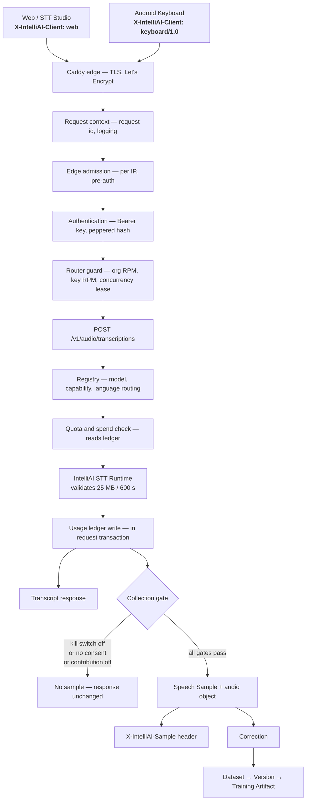
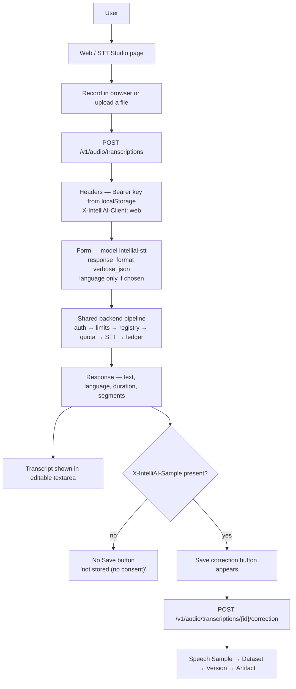
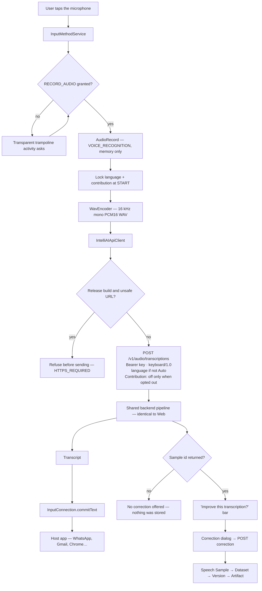
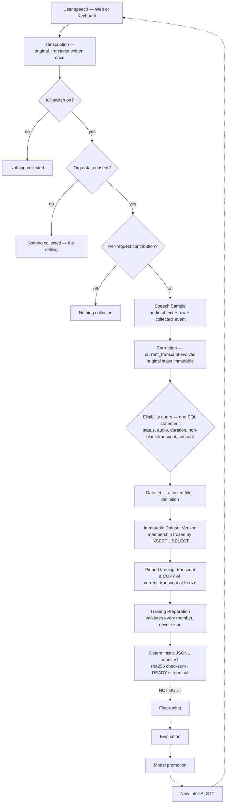

# IntelliAI Platform — Architecture Freeze before Milestone 14

> Point-in-time review at commit **`5d3ce28`** (9 Aug 2026), taken after
> Commit 13E and before Milestone 14 (production deployment / launch).
> Every claim was read from the **implementation**, not from
> documentation. Where the repository does not answer a question, this
> document says so explicitly rather than inferring.
>
> Scope: `apps/api` · `apps/keyboard-android` · `services/stt-runtime` ·
> `packages/` · `infra/`. No code was written or modified to produce it.

---

## Verdicts at a glance

| Question | Answer |
| --- | --- |
| Is the current flow correct? | **YES** — with three corrections (below) |
| Is Web using the same backend as Keyboard? | **YES** |
| Is the data flywheel complete up to Training Artifact? | **YES** |
| Is the architecture ready for Milestone 14? | **YES, conditionally** — one product decision gates it |

---

## Part 1 — What the implementation actually does

The proposed architecture diagram is **substantially correct**. Three
details are wrong, and they matter for Milestone 14 planning.

### Corrections to the proposed diagram

1. **Metering is split, not one step.** The quota/spend check *reads* the
   usage ledger **before** the runtime call; the billable event is
   *written* **after** it. The proposed diagram shows one
   "Usage/Metering" box — there are two, on opposite sides of the
   runtime.
2. **Audio validation is not in the gateway.** The 25 MB / 600 s caps
   live in the STT runtime
   (`services/stt-runtime/src/intelliai_stt_runtime/config.py:32-33`).
   The gateway reads the whole upload into memory first and translates
   the runtime's refusal back into the public error contract.
3. **Rate limiting is a middleware/dependency, not a sequential step.**
   It is attached to the whole `/v1` router in
   `apps/api/src/intelliai_api/main.py:111`, so a new endpoint cannot
   forget to be limited.

### The real request order

| # | Stage | Evidence |
| --- | --- | --- |
| 1 | **Edge** — Caddy terminates TLS, reverse-proxies to the gateway | `infra/Caddyfile` |
| 2 | **RequestContextMiddleware** — mints `X-Request-ID`, binds log context | `main.py:99` |
| 3 | **UnauthenticatedEdgeMiddleware** — per-IP admission *before* any credential is read | `api/edge.py:41` |
| 4 | **Authentication** — Bearer extracted, peppered SHA-256 hash looked up, then revoked/expired checks. The endpoint never sees the raw key | `api/deps.py:80-119`, `services/auth.py:82-96` |
| 5 | **Admission (router-level)** — organization RPM ceiling, per-key RPM as a *subdivision* of it (namespaced by surface), plus a concurrency lease released in a `finally` | `api/deps.py:137-212` |
| 6 | **Route parsing** — multipart form, `_parse_client()`, `_wants_contribution()`, `file.read()` | `api/v1/audio/transcriptions.py:33-75` |
| 7 | **Registry resolution** — public model lookup (404), capability check (`capability_mismatch`), then language resolution. A refused language is recorded as *demand*, not discarded | `services/transcription.py:87-105` |
| 8 | **Capability admission** — an STT-scoped budget, separate from TTS | `services/transcription.py:110-115` |
| 9 | **Entitlement check** — plan quota and spend limit, read from the ledger. *The "quota" half of metering — before the runtime* | `services/transcription.py:119-125` |
| 10 | **STT runtime call** — keyed by *deployment*, not service. The engine is told the *routed* language, never the customer's raw tag. Runtime enforces size/duration. Failures recorded and translated into the public taxonomy | `services/transcription.py:131-165` |
| 11 | **Usage ledger write** — the permanent commercial fact, inside the request's own transaction, recording the *observed* language. *The "billing" half of metering — after the runtime* | `services/transcription.py:182-191` |
| 12 | **Collection gate** — after success, never able to fail the request. Returns a sample id or `None` | `services/collection.py:126-220` |
| 13 | **Response** — OpenAI-shaped body, plus `X-IntelliAI-Sample` **only** when a sample was stored | `api/v1/audio/transcriptions.py:100-122` |

---

## Part 6 — The central architectural claim

> **Does the Android Keyboard use the exact same backend transcription
> pipeline as Web / STT Studio?**

## ✅ YES

There is **one** transcription pipeline. There is no Android-specific
route, service, runtime, or model.

| Claim | Web evidence | Keyboard evidence |
| --- | --- | --- |
| Same endpoint | `fetch("/v1/audio/transcriptions")` — `studio.html:274` | `"$base/v1/audio/transcriptions"` — `IntelliAIApiClient.kt` |
| Same public model | `form.append("model","intelliai-stt")` | `addFormDataPart("model","intelliai-stt")` |
| Same authentication | `Authorization: Bearer <key>` | `Authorization: Bearer <key>` |
| Same STT runtime | Both resolve through one `Registry` to the same deployment; the route has no client-conditional branch (`services/transcription.py:98-152`) ||
| Same response contract | One `create_transcription` handler renders both; only `response_format` differs, and that is a documented API parameter ||
| Same collection | One `DataCollectionService.collect()`; the client is a **column** (`client_source`), never a code path ||
| Same correction | `POST /v1/audio/transcriptions/{id}/correction` with `{corrected_text}` — identical path and body, pinned by `WebKeyboardContractTest` ||
| Same usage metering | Both inherit `enforce_limits` from the `/v1` router and the same `UsageRecorder` dependency ||
| Same dataset flow | Eligibility is one SQL query over `speech_samples` with **no client predicate** (`repositories/datasets.py:257-268`) ||

### Hidden pipelines found: **none**

Searching the transcription path for client-conditional branching finds
exactly two places the client identity is read:

- `_parse_client()` — produces a database label (`client_source`, `client_version`)
- `_wants_contribution()` — can only **narrow** collection

Neither touches routing, the runtime, or the response body.

---

## Part 4 — Web vs Keyboard, area by area

| Area | Web / STT Studio | Android Keyboard | Verdict |
| --- | --- | --- | --- |
| Endpoint | `/v1/audio/transcriptions` | `/v1/audio/transcriptions` | Same |
| HTTP method | POST multipart | POST multipart | Same |
| Authentication | Bearer API key | Bearer API key | Same |
| API-key storage | `localStorage`, plaintext (`console.js:113`) | EncryptedSharedPreferences, Keystore-backed | **Different** |
| Client header | `web` | `keyboard/1.0` | Intentional |
| Language | Omitted when unselected; else `en`/`hi`/`ar` | Omitted for Auto; else same tags | Same |
| Response format | `verbose_json` (needs duration + segments) | default `json` (needs only text) | Same contract |
| Audio format | Browser recording or uploaded file | 16 kHz mono PCM16 WAV | Intentional |
| Audio capture | MediaRecorder / file picker | `AudioRecord`, in-memory only | Intentional |
| Contribution control | **None** — never sends the header | Per-request opt-out via `X-IntelliAI-Contribution: off` | **Different** |
| Consent ceiling | Org `data_consent` | Org `data_consent` | Same |
| Sample creation | Server-side, signalled by header | Server-side, signalled by header | Same |
| Correction | Same endpoint, same body | Same endpoint, same body | Same |
| Transcript delivery | Textarea in the Studio page | `InputConnection` into the host app | Intentional |
| Error handling | Reads `error.message` | Branches on `error.type` into typed outcomes | Keyboard stricter |
| Retry behaviour | None | One bounded retry on the 503 family only | **Different** |
| Rate limiting | Identical — router-level, identity-scoped || Same |
| Quota handling | Identical `EntitlementService` check || Same |
| Usage metering | Identical `UsageRecorder`; `client_source` is a ledger dimension || Same |
| Backend runtime | Same registry, same deployment, same artifact || Same |
| Dataset flow | Same tables, same eligibility query || Same |

Two asymmetries are **not** deliberate client-shape decisions and deserve
a decision in Milestone 14:

- the web console stores its API key in plaintext `localStorage` while
  the keyboard uses Keystore encryption;
- the web has **no** contribution opt-out at all while the keyboard has
  an honest one.

---

## Part 7 — The collection gate, exactly as coded

Gates run in this order, cheapest first. Every miss returns `None`
**silently** — absence of collection is a normal outcome, not an error
(`services/collection.py:126-139`).

| Gate | Condition | Meaning |
| --- | --- | --- |
| 1 · Kill switch | `not self._enabled or self._storage is None` | Deployment-wide off |
| 2 · Consent | `not organization.data_consent` | **The ceiling** — checked first, so nothing below can widen it |
| 3 · Contribution | `not contribute` | Per-request opt-out — can only narrow |

### Answers to the specific questions

**What happens when contribution is OFF?**
The transcription proceeds and returns normally. No sample row, no
object write, and no `X-IntelliAI-Sample` header — so the keyboard
offers no correction, because there is genuinely nothing to correct.

**What happens when organization consent is OFF?**
Identical outcome, and it is checked *before* the contribution flag. A
client that sends no opt-out header — or deliberately asks to
contribute — still collects nothing.
Test: `test_org_consent_off_is_the_ceiling_contribution_cannot_widen`.

**Can a transcription still succeed when collection is disabled?**
**Yes.** The response body is byte-identical either way; only the
presence of one additive header differs.

**Does collection failure ever fail the transcription?**
**No — structurally impossible.** `collect()` wraps everything in a bare
`except Exception` that logs and returns `None`. Row creation runs inside
a savepoint, so a failure there rolls back without poisoning the outer
transaction that already holds the customer's usage event. A storage
write that succeeds before a row failure leaves an orphaned object, and
its key is logged by name for a future sweep.

**Is the original transcript immutable?**
**Yes.** `original_transcript` is written once at collection. `correct()`
assigns only `current_transcript` and appends a `corrected` event.
Nothing in the codebase writes `original_transcript` after creation.

**What transcript gets pinned into a Dataset Version?**
The sample's `current_transcript` *as of the freeze instant*, copied into
`dataset_version_samples.training_transcript` by a single
`INSERT…SELECT` — the database decides the whole set in one statement
(`repositories/datasets.py:376-391`).

**Can later corrections change an already-frozen Dataset Version?**
**No.** The pinned column is a copy, not a reference.
Test: `test_a_frozen_version_never_changes`.

**Can later corrections change an already-prepared artifact?**
**No.** Preparation reads only `member.training_transcript` — never
`current_transcript` — and a `READY` preparation is terminal: a second
POST returns the existing row untouched.
Test: `test_ready_is_terminal_and_immune_to_a_moving_world`.

### A design choice worth naming

Preparation **never silently skips** a bad member. 997 valid of 1,000 is
a `FAILED` preparation with machine-readable reasons per sample — not a
quietly smaller artifact. This is the single most important property for
trusting a future fine-tuning run, and it is enforced by test.

---

## Part 10 — The four diagrams

### Diagram 1 — Current IntelliAI Platform, complete architecture

### Diagram 2 — Web / STT Studio → IntelliAI STT

### Diagram 3 — Android Keyboard → IntelliAI STT

### Diagram 4 — Speech → Data Flywheel → Future Fine-tuning

The dashed segment is the honest boundary: **everything solid exists and
is tested today; nothing dashed has been built.** The flywheel is
complete up to the training artifact and stops exactly where Commit 13E's
scope fence says it should.

---

## Part 8 — Production readiness

### 🟢 GREEN — already correct, do not change

- **One pipeline, two clients.** No Android-specific route, service, or
  runtime exists. The client is a database column, never a branch.
- **Collection can never fail a transcription.** Bare exception backstop
  plus a savepoint around the row write. Customer success outranks
  dataset collection, structurally. (`services/collection.py:101-108, 170`)
- **Consent is a genuine ceiling.** Checked before the per-request flag,
  so no client can opt in beyond the tenant's grant.
- **Reproducibility is enforced, not hoped for.** Pinned transcripts,
  terminal READY preparations, byte-identical manifests, and a test that
  re-runs preparation from scratch and compares bytes.
- **Never silently skip.** Any invalid member fails the whole preparation
  with machine-readable reasons.
- **Tenant isolation returns 404, never 403.** A foreign tenant's
  resource does not exist from your point of view — no existence
  disclosure.
- **Rate limiting is structural.** Attached to the `/v1` router, so a new
  endpoint cannot forget it.
- **Engine names never reach users.** Enforced on the backend and by an
  Android scope-guard test.
- **Error contract branches on `error.type`.** A quota 429 and a
  rate-limit 429 mean opposite things and are handled as such.
- **Deployment and backup runbooks exist and are specific.** Caddy with
  automatic TLS, nightly cron, retention, and an explicit "off-box or it
  isn't a backup" instruction.

### 🟡 YELLOW — must be handled during Milestone 14

- **No production deployment exists.** The runbook is ready; no VPS,
  domain, or DNS has been provisioned. This is Milestone 14's core work.
- **Right-to-erasure has no implementation.** The schema is CASCADE-ready
  and the code comments anticipate it, but there is no endpoint, CLI, or
  job that deletes a sample or a tenant's data. For a product collecting
  voice under India's DPDP Act, this is a legal requirement, not a
  nicety. *(No DELETE route in `speech_samples/routes.py`; no erasure CLI
  subcommand.)*
- **Samples identify a key, not a person.**
  `user_identifier = auth.key_public_id` (`services/collection.py:188`).
  If ten employees share one org key, their samples are
  indistinguishable — so a per-person deletion request cannot be honoured
  at all. This compounds the item above.
- **No upload cap before the runtime.** Neither Caddy nor the gateway
  limits request-body size; the gateway buffers the entire upload in
  memory and only the STT runtime enforces 25 MB. A large-upload flood is
  a memory-pressure vector.
- **Web console stores the API key in plaintext `localStorage`.** Any XSS
  on the origin exfiltrates a live credential. The keyboard's
  Keystore-backed storage is markedly stronger.
- **No error tracking and no metrics.** Structured JSON logs and health
  endpoints exist; there is no Sentry-class error tracker and no
  Prometheus/OpenTelemetry metrics. The runbook calls for an external
  uptime monitor — none is configured.
- **Android release ships no default server.** Correct for 13E, wrong for
  a public app: a user cannot be asked to type an API base URL. Bake the
  domain in once it exists.
- **No release signing key.** Configuration is ready; the keystore must
  be generated, backed up, and never committed.
- **Web has no contribution control.** The keyboard offers an honest
  opt-out; the Studio always contributes. Defensible, but it should be a
  stated decision rather than an accident.
- **Privacy policy and consent disclosure do not exist.** Play Store
  requires a policy URL; DPDP requires meaningful notice. The in-app
  wording is honest, but there is no published document behind it.
- **No STT model version management or rollback.** The registry pins
  artifacts and a manifest command exists, but there is no documented
  procedure for promoting or rolling back a model in production.

### 🔴 RED — architectural problems requiring redesign

**None in what exists.** This review looked specifically for a forked STT
path, a mutable "immutable" version, a collection failure that could fail
a request, and a tenant-isolation hole — and found none.

#### One conditional red — a product decision, not a defect

The keyboard requires each end user to **paste an `ik_live_` API key
obtained from a developer console**. That is a coherent design for an
enterprise or cohort deployment. It is *not* a consumer product shape —
no consumer will do this, and Play Store reviewers will likely question
an app that cannot function without one.

- If Milestone 14 means **enterprise / controlled cohort launch**,
  nothing here needs to change.
- If it means **public consumer launch**, you need user accounts and
  server-issued tokens — genuine architectural work that belongs in the
  plan, not a configuration task.

**This is the one question whose answer changes the shape of Milestone 14.**

---

## Part 9 — Missing pieces, sorted honestly

| Item | State | Missing for… |
| --- | --- | --- |
| Production backend | Runbook + compose + Dockerfiles ready; not deployed | Launch only |
| Production domain | Not provisioned | Launch only |
| HTTPS | Caddy auto-TLS configured, awaiting a domain | Launch only |
| API-key provisioning | `/v1/api-keys` + `bootstrap-org` CLI | **Present** |
| Rate limiting | Edge, org, key, concurrency, capability | **Present** |
| Quota | Plan entitlement + spend limit from the ledger | **Present** |
| Logging | structlog JSON with secret redaction | **Present** |
| Monitoring | Health endpoints only; no external monitor configured | Launch only |
| Error tracking | None | Launch only |
| Metrics | None | Launch only |
| Database backup | Script + cron + retention documented | Launch only *(needs a restore drill)* |
| Object-storage backup | MinIO tarball in the same script | Launch only |
| Android production server config | Guarded and HTTPS-only; default deliberately empty | Launch only |
| Android signing | Gradle wired; no keystore | Launch only |
| Play Store requirements | AAB buildable; no listing, policy, or account | Launch only |
| Privacy policy | Does not exist | Launch only |
| Consent disclosure | In-app wording honest; no published notice | Launch only |
| **Data deletion / retention** | Schema ready; **no implementation** | **Architecture** |
| **Per-person data subject identity** | Samples attributed to a key, not a user | **Architecture** |
| Operational admin controls | CLI: bootstrap, consent grant/revoke, reports | **Present** *(no admin UI)* |
| STT model / version management | Registry pins artifacts; no promotion procedure | Launch + future ML |
| Rollback strategy | Not documented for models; compose redeploy for code | Launch only |
| Dataset reproducibility | Frozen membership + pinned transcripts, tested | **Present** |
| Training artifact reproducibility | Deterministic bytes + checksum, tested | **Present** |

**Only two items are missing for *architecture*:** data erasure and
per-person subject identity. Both are the same underlying gap — the
platform can collect personal voice data but cannot yet delete a specific
person's share of it. Everything else on this list is provisioning,
configuration, or paperwork.

---

## Part 11 — Final verdict

**1 · Is the current flow correct?**
**YES** — with the three corrections in Part 1: metering is split around
the runtime, audio validation lives in the runtime rather than the
gateway, and rate limiting is a router-level dependency rather than a
sequential step.

**2 · Is Web using the same backend as Keyboard?**
**YES** — one endpoint, one model id, one auth path, one registry, one
runtime, one collection service, one correction endpoint, one dataset
pipeline. No hidden Android path exists, and `WebKeyboardContractTest`
now fails the build if anyone forks it.

**3 · Is the data flywheel complete up to Training Artifact?**
**YES** — speech → sample → correction → dataset → immutable version →
pinned transcript → validated deterministic JSONL manifest with a sha256
checksum. Every link is implemented and test-enforced.

**4 · Is the architecture ready for Milestone 14?**
**YES, conditionally** — the architecture is sound and needs no redesign
to deploy. The condition is the launch-shape question: enterprise/cohort
works today; public consumer launch requires user accounts and
server-issued tokens.

**5 · What MUST be fixed before Milestone 14?**

1. **Decide the launch shape** — enterprise cohort or public consumer.
   Everything else follows from this.
2. **Implement data erasure** — per-tenant at minimum, per-sample
   ideally. Legally required before collecting real users' voices.
3. **Add a request-body size limit** at Caddy or the gateway.
4. **Publish a privacy policy** and wire it into the app and console.
5. **Stand up monitoring** — external uptime check and an error tracker,
   before real traffic rather than after.
6. **Run a restore drill** — an untested backup is not a backup.
7. **Generate and safeguard the signing keystore**; losing it means never
   updating the app again.

**6 · What should NOT be changed?**
The single shared pipeline; the collection-never-fails-a-request rule;
consent as the ceiling checked before contribution; the immutability
chain (original → pinned → terminal preparation); never-silently-skip
validation; 404-not-403 tenant isolation; router-level rate limiting; the
public product identity that hides engine names. These are the
load-bearing invariants — every one is test-enforced, and each test is
worth more than the code it guards.

**7 · What is the next milestone after production launch?**
Real-usage operations and the first cohort: onboarding tenants, watching
the ledger and the sample pipeline under genuine load, and accumulating
enough consented, corrected speech that a dataset version becomes worth
freezing. The flywheel needs volume before fine-tuning is meaningful.

**8 · What remains before actual STT fine-tuning?**
The data path is done; the compute path does not exist. Still required:
enough real corrected data to matter, GPU infrastructure, a training
executor that consumes the JSONL manifest, an evaluation harness with a
held-out set and a quality baseline to beat, a promotion mechanism in the
registry, and a rollback path. The registry already carries a
`quality_baseline` string, which is the seam where evaluation will
eventually attach.

---

## Confidence and limits

Every claim above was read from the implementation at commit `5d3ce28`,
not from documentation. Where the repository did not answer a question,
this document says so rather than inferring:

- **STT model rollback procedure** — *not verified from the current
  implementation.*
- **Play Store account status** — *not verified from the current
  implementation.*

The Android observations reflect **emulator verification only**. No
physical device has been tested, and the manual checklist in
[`apps/keyboard-android/RELEASE.md`](../../apps/keyboard-android/RELEASE.md)
remains pending.

### Related documents

- [ARCHITECTURE.md](../ARCHITECTURE.md) — the living architecture handbook
- [adr/](../adr/) — the decisions behind these invariants
- [ops/deployment.md](../ops/deployment.md) — the Milestone 14 runbook
- [ops/backup.md](../ops/backup.md) — backup, retention, restore
- [apps/keyboard-android/RELEASE.md](../../apps/keyboard-android/RELEASE.md) — physical-device checklist
