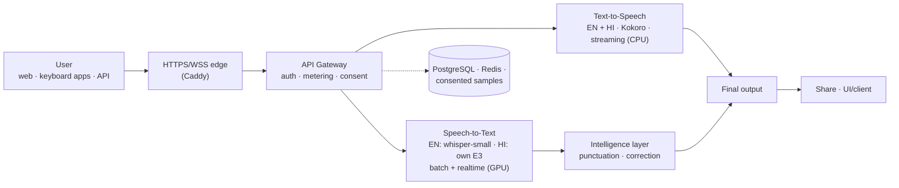
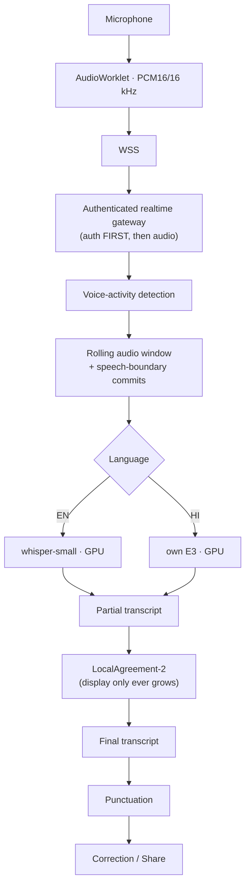
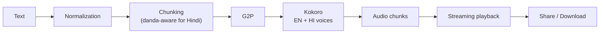

# INTELLIAI PLATFORM — Project Progress Report

**Voice Intelligence Platform — Current Capabilities, Measured Improvements & Roadmap**
1 September 2026 · Prepared by Sumit Das

---

## Page 1 — Where We Are

| Status strip | |
|---|---|
| STT | ✅ English + Hindi (production-approved in repository; serving on staging stack) |
| Realtime STT | ✅ Staging-verified (EN + HI, GPU) |
| TTS | ✅ English + Hindi (production-approved, streaming, CPU) |
| EN / HI | ✅ / ✅ both first-class |
| GPU serving | ✅ Ready (validated on production-like RTX 5070) |
| Production | ⚠️ Pending final infrastructure — no public server deployed yet |

**Executive summary.** IntelliAI has progressed from model
experimentation into an integrated voice platform with measurable
speech recognition (English + Hindi, including our own fine-tuned
Hindi model), live realtime transcription on GPU,
punctuation/readability, streaming text-to-speech, and
correction/sharing workflows — all behind one authenticated, metered
API and a self-serve web console. Every number in this report is a
recorded measurement in the repository, not an estimate.

**BUILT** — EN+HI STT · realtime STT · EN+HI TTS · punctuation ·
correction · sharing · console + API + billing-safe metering.

**IMPROVED** — realtime latency · GPU inference · transcript
readability · Hindi stability · production safeguards.

**DEMONSTRABLE TODAY** — all of the above, live over a secure tunnel
from the staging stack (Section 8).

**NEXT** — production GPU provisioning → final on-box verification →
realtime production promotion → grammar/broken-speech correction.

## 2. Current Performance (scan this)

*All values: measured on the staging stack, production-like RTX 5070
GPU, milestone M55 (latest verified). Not universal guarantees.*

| | EN REALTIME | HI REALTIME | GPU |
|---|---|---|---|
| **First live text** | **1.10 s** p50 (20 runs) | **0.33–0.42 s** | — |
| **Live update p50** | **0.53 s** | **0.62–0.79 s** (all lengths to 10 min) | — |
| **Final transcript** | **0.20 s** p50 | **0.77–1.43 s** | — |
| **VRAM (whole stack)** | — | — | **5.3 GB peak / 8 GB card** |
| **Safe concurrency** | — | — | **2 sessions/GPU** (burst 4) |

## 3. Before → Now

| Area | Before | Now |
|---|---|---|
| STT experience | speak → stop → upload → wait → transcript | speak → **transcript appears live** → punctuated final on Stop |
| Realtime | none | EN + HI live sessions, GPU, staging-verified in real browsers |
| Transcript readability | raw run-on text ("hello sumit how are you") | punctuation both languages ("Hello Sumit, how are you?") — words guaranteed unchanged |
| Hindi STT stability | same 30 s clip: 2–94 words across CPU runs | **117 words, byte-identical ×5** on GPU serving |
| TTS | first audio scaled with text length (27+ s worst case) | streaming: first audio **0.4–1.3 s regardless of length** |
| User correction | none | in-console correction saved via real endpoint → consented training data |
| Sharing | none | one-tap transcript share + exact-WAV audio share |
| GPU serving | untested | validated: both engines + Hindi batch on one 8 GB card, failure drills + alerts proven |

## 4. What Is New (for the manager)

1. **Realtime STT** — text appears while the user speaks; punctuated
   final on Stop. *Benefit: the modern dictation experience.*
2. **English + Hindi as equals** — both languages across STT, realtime,
   TTS, punctuation; Hindi runs on a model we own and improve.
   *Benefit: the market we target, natively.*
3. **English punctuation** — readable sentences, +45 ms on a 102 s
   clip, words never altered. *Benefit: transcripts people can use.*
4. **Hindi punctuation** — same guarantee for Hindi (danda, question
   marks). *Benefit: parity, not an afterthought.*
5. **TTS with streaming** — 4 voices, local inference, first audio in
   ~0.4–1.3 s. *Benefit: voice output that starts immediately.*
6. **Correction** — users fix transcripts in place; fixes become
   consented training data. *Benefit: the product improves with use.*
7. **Share** — transcripts and generated audio share in one tap.
   *Benefit: results leave the app.*
8. **GPU acceleration** — 15–20× headroom over CPU; also fixed a real
   Hindi reliability defect. *Benefit: speed AND correctness.*

## 5. Architecture

*(Boss's question — "have you created any architecture diagram?" —
Yes: three, maintained in `docs/architecture/`. Compact views below.)*

### 5.1 Platform (executive view)



### 5.2 Realtime STT



### 5.3 TTS



## 6. Realtime Experience (the visible change)

```
OLD:  Speak → Stop → Wait → Transcript

NEW:  Speak → live partial text → keep speaking
        → Stop → final transcript → punctuation → correct / share
        (+ hear your own recording back in the player)
```

Proven in real browsers (fake-microphone Chromium through the full
stack, plus manual sessions): 10-minute sessions stay clean, silence
stores nothing, flooding degrades loudly and still completes, two
sessions never mix, a killed GPU produces an honest error.

## 7. STT Metrics

**Table A — Batch (upload/record):**

| Metric | Value | Context (model · data · hardware · mode · milestone) |
|---|---|---|
| English WER | 0.000 | whisper-small · internal seed eval · CPU · batch · M2 |
| English vs competitor | within ~4 pts of Sarvam | real 102 s clip, n=1 · batch · M48 |
| Hindi WER | **10.92%** | own E3 · real 30 s multi-speaker · **GPU** · batch · M55 |
| Hindi WER (30-clip avg) | 15.6% | own E3 · IndicVoices real speech · GPU · offline · M52H |

**Table B — Realtime (staging, RTX 5070, M55):**

| Metric | English | Hindi |
|---|---:|---:|
| Engine | whisper-small | own E3 |
| Hardware | GPU | GPU |
| First text (FPT) | 1.10 s p50 | 0.33–0.42 s |
| Partial p50 | 0.53 s | 0.62–0.79 s |
| Finalization | 0.20 s p50 | 0.77–1.43 s |
| Long session (10 min) | clean, p50 0.53 s | clean, final 1.31 s |
| Quality | 2.08% WER vs our batch text | within the batch model's band vs ground truth |

**Why GPU for realtime?** Realtime must process audio faster than the
user speaks. Hindi E3 on 1 s of audio: **CPU ~0.9–1.3 s** vs **GPU
0.064 s** (measured same day, same model, current tested hardware).
GPU gives the headroom to keep up with live speech; CPU remains fine
for background/batch English work.

## 8. What I Can Demonstrate Today

| | Where |
|---|---|
| ✅ English realtime STT | Staging (via secure tunnel, normal browser) |
| ✅ Hindi realtime STT | Staging |
| ✅ English punctuation | Staging |
| ✅ Hindi punctuation | Staging |
| ✅ English TTS (streaming) | Staging |
| ✅ Hindi TTS (streaming) | Staging |
| ✅ Transcript share + audio share | Staging |
| ✅ Correction workflow | Staging |
| ✅ GPU realtime inference (live metrics) | Staging |

*Nothing is marked Production because no public server is live yet.*

## 9. TTS (brief)

English + Hindi, 2 voices each, local CPU inference, true streaming
(first audio 0.4–1.3 s regardless of length), unified playback,
audio sharing. Quality judged by round-trip through our own STT:
EN trap-set WER **0.0659** (hardened from 0.1247), HI clean
**0.045–0.062** (M35–M40). **Why Kokoro:** won on measured
quality-per-CPU-cost with a permissive license. **Why not Qwen3-TTS
now:** its base model can win on clean text but fine-tuning collapsed
and serving economics lost — kept as research (M44/M45).

## 10. Why IntelliAI Is More Than a Model API

| GENERIC MODEL CALL | INTELLIAI PRODUCT |
|---|---|
| audio → model → text | audio → **authenticated session** → **VAD** (silence costs nothing, no hallucination) → realtime GPU inference → **stable partials** (text only grows) → **punctuation** (words guaranteed) → **correction** (training-data flywheel) → **sharing** → **provenance/consent/rollback** at every step |
| best-effort output | measured against frozen benchmarks; append-only evidence ledger |
| fails silently | degrades loudly; honest health (`ready/degraded/disabled`); drilled one-switch rollback; alerts proven to fire |
| your audio on someone's cloud | all inference on our machines; nothing stored without consent |

## 11. Deployment Status

Legend: ✅ working · ⚠️ prepared/pending · ❌ not present

| Component | Local | Staging | Production |
|---|:---:|:---:|:---:|
| English STT (batch) | ✅ | ✅ | ⚠️ approved, not deployed |
| Hindi STT (batch) | ✅ | ✅ | ⚠️ approved, not deployed |
| Realtime EN | ✅ | ✅ | ❌ flag OFF (config prepared) |
| Realtime HI | ✅ | ✅ | ❌ flag OFF (config prepared) |
| TTS EN + HI | ✅ | ✅ | ⚠️ approved, not deployed |
| English punctuation | ✅ | ✅ | ❌ pinned OFF until launch |
| GPU serving | ✅ | ✅ | ⚠️ validated production-like; box not provisioned |

**Plainly: nothing is live on a public production server yet.** The
repository is deployment-ready (rehearsed on clean Linux); the staging
stack runs everything and is demo-able today.

## 12. Current Blockers (real ones)

1. **Production GPU box provisioning** — the infrastructure decision;
   one VPS + one 8 GB GPU runs the whole voice stack.
2. **Final production-GPU re-verification** — all GPU numbers are from
   the dev RTX 5070 (honestly labeled production-like); the scripted
   battery re-runs on the real box in ~1 hour.
3. **Alert scheduling on the production host** — the alert checker
   exists and is proven to fire; it needs a schedule on the real box.
4. **Founder/product decision on recorded latency** — EN first-text
   ~1.1 s vs a 1 s target; HI long finals ≤1.4 s. Recommendation:
   acceptable for v1.

## 13. Roadmap — Where We Are Heading

```
NOW: staging-verified platform, GPU-ready
  ↓  Production GPU infrastructure (VPS + 8 GB GPU)
  ↓  Final production verification (scripted, ~1 hour)
  ↓  Realtime STT production promotion (prepared config switch)
  ↓  Grammar / broken-speech correction (+ next languages)
```

## 14. Key Takeaways

1. **Built:** a full bilingual voice platform — STT, realtime, TTS,
   punctuation, correction, sharing — behind one metered API and
   console, with our own Hindi model.
2. **Biggest technical improvement:** realtime transcription on GPU,
   plus the elimination of a real Hindi reliability defect by GPU
   serving.
3. **Current performance:** live text in 0.33–1.1 s, updates every
   ~0.5–0.8 s, finals in 0.2–1.4 s — measured, on production-like GPU.
4. **Differentiation:** product engineering around the models —
   sessions, stability, word-safe punctuation, correction flywheel,
   privacy, honest failure modes — all measured.
5. **Needed next:** one infrastructure step (VPS + GPU), a one-hour
   verification, then a prepared promotion switch.

---

*Sources: M23–M26 (Hindi model) · M28–M30, M49–M51 (punctuation) ·
M32–M42 (TTS) · M48 (competitor) · M52–M55 (realtime + GPU) · model
ledger. Environments always labeled; M55 is the current
production-like GPU reference.*
